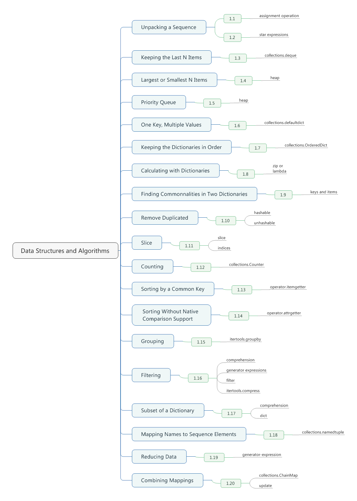

# Chapter 01. Data Structures and Algorithms




## 1.1 Unpacking a Sequence into Separate Variables

- Any sequence (or iterable) can be unpacked into variables using a simple assignment operation.
```python
# x = 4, y = 5 
p = (4,5)
x, y = p
```

## 1.2 Unpacking Elements from Iterables of Arbitrary Length

- Python "star expressions" can be used to address this problem.
```python
# Remove the first and the last element values
def drop_first_last(grades):
    first, *middle, last = grades
    return avg(middle)
```

- It is worth noting that the star syntax can be especially useful when iterating over a sequence of tuples of varing length.
```python
records = [
    ('foo', 1, 2),
    ('bar', 'hello'),
    ('foo', 3, 4)
]

def do_foo(x, y):
    print('foo', x, y)

def do_bar(s):
    print('bar', s)

for tag, *args in records:
    if tag == 'foo':
        do_foo(*args)
    elif tag == 'bar':
        do_bar(*args)

# foo 1 2
# bar hello
# foo 3 4
```

## 1.3 Keeping the last N Items

- Using *deque(maxlen=N)* creates a fixed-sized queue.
```python
from collections import deque

def search(lines, pattern, history = 5):
    previous_lines = deque(maxlen = history) 
    for line in lines:
        if pattern in line:
            yield line, previous_lines
        previous_lines.append(line)

if __name__ == '__main__':
    with open('somefile.txt') as f:
        for line, prevlines in search(f, 'python', 5):
            for pline in prevlines:
                print(pline, end='')
            print(line, end='')
            print('-' * 20)
```

## 1.4 Finding the Largest or Smallest N Items

- The most important feature of a heap is that *heap[0]* is always the smallest item.
- *heap.heappop()*
 - Pops off the first item and replaces it with the next smallest item.
 - An peration that requires* O(log N)* operations where *N* is the size of the heap.
```python
import heapq

nums = [1, 8, 2, 23, 7, -4, 18, 23, 42, 37, 2]
print(heapq.nlargest(3, nums))
print(heapq.nsmallest(3, nums))

# [42, 37, 23]
# [-4, 1, 2]
```

## 1.5 Implementing a Priority Queue

- Class uses the heapq module to implement a simple priority queue.
```python
import heapq

class PriorityQueue:
    def __init__(self):
        self._queue = []
        self._index = 0
    def push(self, item, priority):
        heapq.heappush(self._queue, (-priority, self._index, item)) # The priority value is negated to get the queue to sort items from highest piority to low priority.
        self._index += 1
    def pop(self):
        return heapq.heappop(self._queue)[-1]

class Item:
    def __init__(self, name):
        self.name = name
    def __repr__(self):
        return 'Item({!r})'.format(self.name)

q = PriorityQueue()
q.push(Item('foo'), 1)
q.push(Item('bar'), 5)
q.push(Item('spam'), 4)
q.push(Item('grok'), 1)
print(q.pop()) # Item('bar')
print(q.pop()) # Item('spam')
print(q.pop()) # Item('foo')
print(q.pop()) # Item('grok')
```

## 1.6 Mapping Keys to Multiple Values in a Dictionary

- A feature of *defaultdict* is that it automatically initialized the first value so you can simply focus on adding items.
```python
from collections import defaultdict

d = defaultdict(list)
d['a'].append(1)
d['a'].append(2)
d['b'].append(4)
print(d) # defaultdict(<class 'list'>, {'b': [4], 'a': [1, 2]})

e = defaultdict(set)
e['a'].add(1)
e['a'].add(2)
e['b'].add(4)
print(e) # defaultdict(<class 'set'>, {'b': {4}, 'a': {1, 2}})
```

## 1.7 Keeping the Dictionaries in Order

- Use an *OrderedDict* from the *collections* module. It exactly preserves the original **insertion order** of data when iterating.
```python
from collections import OrderedDict

d = OrderedDict()
d['foo'] = 1
d['bar'] = 2
d['spam'] = 3
d['grok'] = 4

for key in d:
    print(key, d[key])

# foo 1
# bar 2
# spam 3
# grok 4
```

## 1.8 Calculating with Dictionaries

- In order to perform userfule calculations on dictionary contents, it is often useful to invert the keys and values of dictionary using *zip()*
- When doing these calculations, be aware that zip() creates an iterator that can only be consumed once.
```python
prices = {
    'ACME': 45.23,
    'AAPL': 612.78,
    'IBM': 205.55,
    'HPQ': 37.20,
    'FB': 10.75
}

min_price = min(zip(prices.values(), prices.keys()))
max_price = max(zip(prices.values(), prices.keys()))
print(min_price) # (10.75, 'FB')
print(max_price) # (612.78, 'AAPL')

# The built-in min() and max() function takes a key argument that can be passed a callable that will return some value in the object that min or max will use to compare the objects.
print(min(prices, key = lambda k: prices[k])) # FB
print(max(prices, key = lambda k: prices[k])) # AAPL

# Compare the keys
print(min(prices)) # APPL
print(max(prices)) # IBM
```

## 1.9 Finding Commonalities in Two Dictionaries

- To find out what the two dictionaries have in common, simply perform common set operations using the *keys()* or *items()* methods.
- The *keys()* method of a dictionary returns a keys-view object that exposed the keys.
- The *items()* method of a dictionary returns and items-view object consisting of *(key, value)* pairs.
- The *values()* method of a dictionary does not support the set operations described in this recipe.
```python
a = {
    'x': 1,
    'y': 2,
    'z': 3
}

b = {
    'w': 10,
    'x': 11,
    'y': 2
}

print(a.keys() & b.keys()) # {'x', 'y'}
print(a.keys() - b.keys()) # {'z'}
print(a.items() & b.items()) # {('y', 2)}

c = {key: a[key] for key in a.keys() - {'z', 'w'}} # c is {'x': 1, 'y': 2}
```

## 1.10 Removing Duplicateds from a Sequence while Maintaining Order

- If the values in the sequence are hashable.
```python
def dedupe(items):
    seen = set()
    for item in items:
        if item not in seen:
            yield item
            seen.add(item)

a = [1, 5, 2, 1, 9, 1, 5 ,10]
print(list(dedupe(a))) # [1, 5, 2, 9, 10]
```

- If you are trying to eliminate duplicates in a sequence of unhashable types(such as dicts).
- This solution also works nicely if you want to eliminate duplicates based on the value of a single field or attribute or a larger data structure.
```python
def dedupe(items, key = None):
    seen = set()
    for item in items:
        val = item if key is None else key(item)
        if val not in seen:
            yield item
            seen.add(val)

a = [{'x': 1, 'y' : 2}, {'x': 1, 'y' : 3}, {'x': 1, 'y' : 2}, {'x': 2, 'y' : 4}]
print(list(dedupe(a, key = lambda d: (d['x'], d['y']))))
print(list(dedupe(a, key = lambda d: d['x'])))

# [{'x': 1, 'y': 2}, {'x': 1, 'y': 3}, {'x': 2, 'y': 4}]
# [{'x': 1, 'y': 2}, {'x': 2, 'y': 4}]
```

- If all you want to do is eliminate duplicates, it is often easy enough to make a set. However, this approach doesn't preserve any kind of ordering.

## 1.11 Naming a Slice

- In general, the build-in *slice()* creates a slice object that can be used anywhere a slice is allowed.
- If you have a **slice** instance *s*, you can get more information about it by looking at its *s.start*, *s.stop*, *s.step* attributes, respectively.
```python
items = [0, 1, 2, 3, 4, 5, 6]
a = slice(2, 4)
print(items[2:4]) # [2, 3]
print(items[a]) # [2, 3]
items[a] = [10,11]
print(items) # [0, 1, 10, 11, 4, 5, 6]
del items[a]
print(items) # [0, 1, 4, 5, 6]
```

- You can map a slice onto a sequence of a specific size by using its *indices(size)* method. This returns a tuple *(start, stop, step)* where all values have been suitable limited to fit within bounds.
```python
a = slice(10, 50, 2)
s = 'Hello, World!'
print(a.indices(len(s)))
for i in range(*a.indices(len(s))):
    print(s[i])

# (10, 13, 2)
# l
# !
```

## 1.12 Determining the Most Frequently Occurring Items in a Sequence

- The *collections.Counter* class is designed for just such a problem. It even comes with a handy *most_common()* method that will give you the answer.
- As input, Counter objects can be fed any sequence of hashable input items. Such as a dictionary.
- Alternatively, you could use the *update()* method to count another list.
```python
words = [
    'look', 'into', 'my', 'eyes', 'look', 'into', 'my', 'eyes',
    'the', 'eyes', 'the', 'eyes', 'the', 'eyes', 'not', 'around', 'the',
    'eyes', "don't", 'look', 'around', 'the', 'eyes', 'look', 'into',
    'my', 'eyes', "you're", 'under'
]

morewords = ['why', 'are', 'you', 'not', 'looking', 'in', 'my', 'eyes']

from collections import Counter

word_counts = Counter(words)
top_three = word_counts.most_common(3)
print(top_three) # [('eyes', 8), ('the', 5), ('look', 4)]
print(word_counts['not']) # 1
print(word_counts['eyes']) # 8

a = Counter(words)
b = Counter(morewords)
print(a) 
# Counter({'eyes': 8, 'the': 5, 'look': 4, 'into': 3, 'my': 3, 'around': 2, "you're": 1, 'not': 1, 'under': 1, "don't": 1})
print(b) 
# Counter({'eyes': 1, 'why': 1, 'my': 1, 'not': 1, 'in': 1, 'you': 1, 'are': 1, 'looking': 1})
print(a + b) 
# Counter({'eyes': 9, 'the': 5, 'look': 4, 'my': 4, 'into': 3, 'not': 2, 'around': 2, 'you': 1, 'looking': 1, "don't": 1, "you're": 1, 'under': 1, 'in': 1, 'why': 1, 'are': 1})
print(a - b) 
# Counter({'eyes': 7, 'the': 5, 'look': 4, 'into': 3, 'my': 2, 'around': 2, "don't": 1, "you're": 1, 'under': 1})
```

## 1.13 Sorting a List of Dictionaries by a Common Key

- Sorting this type of structure is easy using the *operator* module's itemgetter function.
- The *itemgetter()* function can also accept multiple keys.
```python
rows = [
    {'fname': 'Brian', 'lname': 'Jones', 'uid': 1003},
    {'fname': 'David', 'lname': 'Beazley', 'uid': 1002},
    {'fname': 'John', 'lname': 'Cleese', 'uid': 1001},
    {'fname': 'Big', 'lname': 'Jones', 'uid': 1004},
]

from operator import itemgetter
# Apply to min() and max() too.
rows_by_fname = sorted(rows, key=itemgetter('fname')) # rows_by_fname = sorted(rows, key = lambda r : r['fname'])
print(rows_by_fname)
# [{'fname': 'Big', 'uid': 1004, 'lname': 'Jones'},
# {'fname': 'Brian', 'uid': 1003, 'lname': 'Jones'},
# {'fname': 'David', 'uid': 1002, 'lname': 'Beazley'},
# {'fname': 'John', 'uid': 1001, 'lname': 'Cleese'}]

rows_by_uid = sorted(rows, key=itemgetter('uid'))
print(rows_by_uid)
# [{'fname': 'John', 'uid': 1001, 'lname': 'Cleese'},
# {'fname': 'David', 'uid': 1002, 'lname': 'Beazley'},
# {'fname': 'Brian', 'uid': 1003, 'lname': 'Jones'},
# {'fname': 'Big', 'uid': 1004, 'lname': 'Jones'}]

rows_by_lfname = sorted(rows, key=itemgetter('lname', 'fname')) # rows_by_lfname = sorted(rows, key = lambda r : (r['lname'], r['fname']))
print(rows_by_lfname)
# [{'fname': 'David', 'uid': 1002, 'lname': 'Beazley'},
# {'fname': 'John', 'uid': 1001, 'lname': 'Cleese'},
# {'fname': 'Big', 'uid': 1004, 'lname': 'Jones'},
# {'fname': 'Brian', 'uid': 1003, 'lname': 'Jones'}]
```

## 1.14 Sorting Objects Without Native Comparison Support Problem

- The built-in *sorted()* function takes a *key* argument that can be passed a callable that will return some value in the object that *sorted* will use to compare the objects.
- If you have a sequence of *User* instances in your application, and you want to sort them by their *user_id* attribute, you would supply a callable that takes a User isntance as input and returns the *user_id*.
- Instead of using *lambda*, an alternative approach is to use *operator.attrgetter()*.
```python
class User:
    def __init__(self, user_id):
        self.user_id = user_id
    def __repr__ (self):
        return 'User({})'.format(self.user_id)

users = [User(23), User(3), User(99)]
print(users) #[User(23), User(3), User(99)]
print(sorted(users, key = lambda u : u.user_id)) # [User(3), User(23), User(99)]

from operator import attrgetter
print(sorted(users, key = attrgetter('user_id'))) # [User(3), User(23), User(99)]
```

## 1.15 Grouping Records Together Based on a Field

- The *itertools.groupby()* function is particularly useful for grouping data together like this.
- An important preliminary step is sorting the data according to the field of interest.
- Since *groupby()* only examines consecutive items, failing to sort first won't group the records as you want.
```python
rows = [
    {'address': '5412 N CLARK', 'date': '07/01/2012'},
    {'address': '5148 N CLARK', 'date': '07/04/2012'},
    {'address': '5800 E 58TH', 'date': '07/02/2012'},
    {'address': '2122 N CLARK', 'date': '07/03/2012'},
    {'address': '5645 N RAVENSWOOD', 'date': '07/02/2012'},
    {'address': '1060 W ADDISON', 'date': '07/02/2012'},
    {'address': '4801 N BROADWAY', 'date': '07/01/2012'},
    {'address': '1039 W GRANVILLE', 'date': '07/04/2012'}
]

from operator import itemgetter
from itertools import groupby

rows.sort(key = itemgetter('date'))

for date, items in groupby(rows, key = itemgetter('date')):
    print(date)
    for i in items:
        print(' ', i)

# 07/01/2012
#   {'address': '5412 N CLARK', 'date': '07/01/2012'}
#   {'address': '4801 N BROADWAY', 'date': '07/01/2012'}
# 07/02/2012
#   {'address': '5800 E 58TH', 'date': '07/02/2012'}
#   {'address': '5645 N RAVENSWOOD', 'date': '07/02/2012'}
#   {'address': '1060 W ADDISON', 'date': '07/02/2012'}
# 07/03/2012
#   {'address': '2122 N CLARK', 'date': '07/03/2012'}
# 07/04/2012
#   {'address': '5148 N CLARK', 'date': '07/04/2012'}
#   {'address': '1039 W GRANVILLE', 'date': '07/04/2012'}
```

## 1.16 Filtering Sequence Elements

- The easiest way to filter sequence data is often to use a list **comprehension**.
```python
#list comprehension
mylist = [1, 4, -5, 10, -7, 2, 3, -1]
results = [n for n in mylist if n > 0]
print(results) # [1, 4, 10, 2, 3]
```

- Use **generator expressions** to produce the filtered values interatively.
```python
mylist = [1, 4, -5, 10, -7, 2, 3, -1]
pos = (n for n in mylist if n > 0)
print(pos)
for x in pos:
    print(x)

# <generator object <genexpr> at 0x004F40C0>
# 1
# 4
# 10
# 2
# 3
```

- Use the built-in *filter()* function.
```python
values = ['1', '2', '-3', '-', '4', 'N/A', '5']

def is_int(val):
    try:
        x = int(val)
        return True;
    except ValueError:
        return False;

ivals = list(filter(is_int, values))
print(ivals) # ['1', '2', '-3', '4', '5']
```

- Another notable filtering tool is *itertools.compress()*, which takes an iterable and an accompanying **Boolean** selector sequence as input. As output, it gives you all of the items in the iterable where the corresponding element in the selector is **True**.
- Now suppose you want to make a list of all addresses where the corresponding count value was greater than 5.
```python
# compress function
addresses = [
    '5412 N CLARK',
    '5148 N CLARK',
    '5800 E 58TH',
    '2122 N CLARK',
    '5645 N RAVENSWOOD',
    '1060 W ADDISON',
    '4801 N BROADWAY',
    '1039 W GRANVILLE',
]

counts = [0, 3, 10, 4, 1, 7, 6, 1]

from itertools import compress

more5 = [n > 5 for n in counts]
print(more5) # [False, False, True, False, False, True, True, False]
print(list(compress(addresses, more5))) # ['5800 E 58TH', '1060 W ADDISON', '4801 N BROADWAY']
```

## 1.17 Extracting a Subset of a Dictionary

- Using a dictionary comprehension.
```python
prices = {
    'ACME': 45.23,
    'AAPL': 612.78,
    'IBM': 205.55,
    'HPQ': 37.20,
    'FS': 10.75
}
p1 = {key:value for key, value in prices.items() if value > 200}
print(p1) # {'AAPL': 612.78, 'IBM': 205.55}
tech_names ={'AAPL', 'IBM', 'HPQ', 'MSFT'}
p2 = {key:value for key,value in prices.items() if key in tech_names}
print(p2) # {'IBM': 205.55, 'HPQ': 37.2, 'AAPL': 612.78}
```

- Creating a sequence of tuples and passing them to the *dict()*.
```python
p1 = dict((key, value) for key, value in prices.items() if value > 200)
p2 = { key:prices[key] for key in prices.keys() & tech_names }
```

## 1.18 Mapping Names to Sequence Elements

- *collections.namedtuple()* provides these benefits, while adding minimal overhead over using a normal tuple object.
- You feed it a type name, and the fields it should have, and it returns a class that you can instantiate, passing in values for the fields you've defined.
```python
from collections import namedtuple

Stock = namedtuple('Stock', ['name', 'shares', 'price'])

def compute_cost(records):
    total = 0.0
    for rec in records:
        s = Stock(*rec)
        total += s.shares * s.price
    return total

prices = [
    ['ACME', 0.2, 45.23],
    ['AAPL', 0.2, 612.78],
    ['IBM', 0.2, 205.55],
    ['HPQ', 0.2, 37.20],
    ['FS', 0.2, 10.75]
]

print(compute_cost(prices)) # 182.30200000000002 = 0.2 *(45.23 + 612.78 + 205.55 + 37.20 + 10.75)
```

- You also can use *namedtuple* as a replacement of a dictionary, which requires more space to store.
- However, be aware that unlike a dictionary, a *namedtuple* is immutable.
```python
s = Stock('ACME', 100, 123.45)
print(s)
s.shares = 75

# Stock(name='ACME', shares=100, price=123.45)
# Traceback (most recent call last):
#   File "F:\Learning\Python\Cookbook\test.py", line 6, in <module>
#     s.shares = 75
# AttributeError: can't set attribute
```

- If you need to change any of the attributes, it can be done using the *_replace()* method of a *namedtuple* instance, which makes an entirely new *namedtuple* with specified values replaced.
```python
from collections import namedtuple

Stock = namedtuple('Stock', ['name', 'shares', 'price', 'date', 'time'])
stock_prototype = Stock('', 0, 0.0, None, None);

def dict_to_stock(s):
    return stock_prototype._replace(**s)

a = {'name': 'ACME', 'shares': 100, 'price': 123.45}
print(dict_to_stock(a))
# Stock(name='ACME', shares=100, price=123.45, date=None, time=None)
b = {'name': 'ACME', 'shares': 100, 'price': 123.45, 'date': '12/17/2012'}
print(dict_to_stock(b))
# Stock(name='ACME', shares=100, price=123.45, date='12/17/2012', time=None)
```

## 1.19 Transforming and Reducing Data at the Same Time

- A very elegant way to combine a data reduction and a transformation is to use a **generator-expression** argument.
- Using a generator arguments is often a more efficient and elegant approach that first creating a temporary list.
```python
import os
files = os.listdir('F:\study\Python')
if any(name.endswith('.py') for name in files):
    print('There be python!')
else:
    print('Sorry, no python.') # There be python!

s = ('ACME', 50, 123.45)
print(','.join(str(x) for x in s)) # ACME,50,123.45

portfolio = [
    {'name':'GOOG', 'shares': 50},
    {'name':'YHOO', 'shares': 75},
    {'name':'AOL', 'shares': 20},
    {'name':'SCOX', 'shares': 65}
]
min_shares = min(s['shares'] for s in portfolio)
print(min_shares) # 20
```

## 1.20 Combining Multiple Mappings into a Single Mapping

- An easy way to do this is to user the *ChainMap* class from the module.
- However, the mappings are not literally merged together. Instead, a ChainMap simple keeps a list of the underlying mappings and redefines common dictionary operations to scan the list.
- If there are duplicate keys, the values from the first mapping get used.
- Operations that mutate the mapping always affect the first mapping listed.
- A ChainMap uses the orginal dictionaries.
```python
a = {'x': 1, 'z': 3}
b = {'y': 2, 'z': 4}
from collections import ChainMap
c = ChainMap(a, b)
print(c) # ChainMap({'x': 1, 'z': 3}, {'y': 2, 'z': 4})
print(c['x']) # 1
print(c['y']) # 2
print(c['z']) # 3
c['x'] = 22
print(c) # ChainMap({'x': 22, 'z': 3}, {'y': 2, 'z': 4})
c['w'] = 25
print(a) # {'w': 25, 'z': 3, 'x': 22}
c = c.parents
print(c) # ChainMap({'y': 2, 'z': 4})
```

- A ChainMap is particularly useful when working with scoped values such as variables in a programming language.
```python
from collections import ChainMap

values = ChainMap()
values['x'] = 1
values = values.new_child() # Add a new mapping
values['x'] = 2
values = values.new_child()
values['x'] = 3

print(values)

print(values['x'])
values = values.parents # Discard last mapping
print(values['x'])
values = values.parents
print(values['x'])

print(values)

# ChainMap({'x': 3}, {'x': 2}, {'x': 1})
# 3
# 2
# 1
# ChainMap({'x': 1})
```

- As an alternative to ChainMap, you might consider merging dictionaries together using *update()* method.
- It requires you to make a completely seperate dictionary object.
- Also, if any of the original dictionaries mutate, the changes don't get reflected in the merged dictionary.
```python
a = {'x': 1, 'z': 3}
b = {'y': 2, 'z': 4}
merged = dict(b)
merged.update(a)
print(merged['x']) # 1
print(merged['y']) # 2
print(merged['z']) # 3
a['x'] = 22
print(merged['x']) # 1
```
