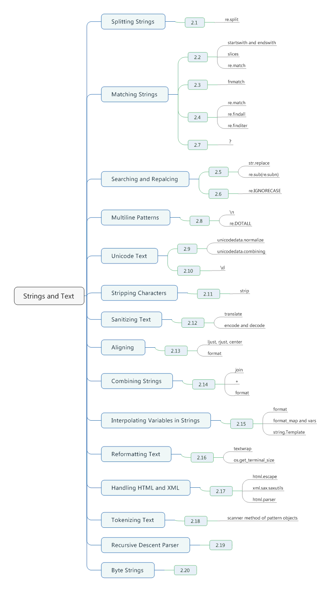

# Chapter02. Strings and Text



## 2.1 Splitting Strings on Any of Mutiple Delimiters

- The *split()* method of string objects is really meant for very simple cases, and does not allow for multiple delimiters or account for possible whitespace around the delimiters.
- In cases when you need a bit more flexibility, use the *re.split()* method.
- Feed *re.split()* with regular expression pattern.
- If capture groups *()* are used, then the matched text is also included in the result.
- If you don't want the separator characters in the result, but still need parentheses to group parts of the regular expression pattern, make sure you use a noncapture group, specified as (?:).
```python
line = 'asdf fjdk; afed, fjek,asdf,     foo'
import re
splits = re.split(r'[;,\s]\s*',line) # [] expression means "or", '\s' means whitespace
splits2 = re.split(r'(;|,|\s)\s*', line)
print(splits) # ['asdf', 'fjdk', 'afed', 'fjek', 'asdf', 'foo']
print(splits2) # ['asdf', ' ', 'fjdk', ';', 'afed', ',', 'fjek', ',', 'asdf', ',', 'foo']

values = splits2[::2]
print(values) # ['asdf', 'fjdk', 'afed', 'fjek', 'asdf', 'foo']
delimiters = splits2[1::2] + ['']
print(delimiters) # [' ', ';', ',', ',', ',', '']

splits3 = re.split(r'(?:,|;|\s)\s*', line); # ['asdf', 'fjdk', 'afed', 'fjek', 'asdf', 'foo']
print(splits3)
```

## 2.2 Matching Text at the Start or End of a String

- A simple way to check the beginning or end of a string is to use the str.*startswith()* or *str.endswith()* methods.
- Oddly, this is one part of Python where a tuple is actually required as input. If you happen to have the choices specified in a list or set, just make sure you convert them using *tuple()* first.
```python
import os
filenames = os.listdir('.')
print(filenames)
print([name for name in filenames if name.endswith(('.py','.markdown'))])

choices = ['http:', 'ftp:']
url = 'http://www.python.org'
print(url.startswith(tuple(choices))) # it must be tuple

# Result:
# ['Note.markdown', 'python-cookbook-master', 'python-cookbook-master.zip', 'test.py']
# ['Note.markdown', 'test.py']
# True
```

- Similar operations can be performed with slices.
```python
>>> filename = 'spam.txt'
>>> filename[-4:] == '.txt'
True
>>> url = 'http://www.python.org'
>>> url[:5] == 'http:' or url[:6] == 'https:' or url[:4] == 'ftp:'
```

- You might also be inclined to use regular expressions as an alternative.
```python
>>> import re
>>> url = 'http://www.python.org'
>>> re.match('http:|https:|ftp:', url)
<_sre.SRE_Match object; span=(0, 5), match='http:'>
```

## 2.3 Matching Strings Using Shell Wildcard Patterns

- The *fmatch* moduel provides two functions -- *fnmatch()* and *fnmatchcase()* -- that can be used to perform such matching.
- *fnmatch()* matches patterns using the same case-sensitivity rules as the system's underlying filesystem, however, *fnmatchcase()* is case-sensitive.
```python
# fnmatchcase function is case-sensitive
from fnmatch import fnmatch, fnmatchcase

print(fnmatch('Dat45.csv', 'Dat[0-9]*'))
names = ['Dat1.csv', 'Dat2.csv', 'config.ini', 'foo.py']
name_csv = [name for name in names if fnmatch(name, 'Dat*.csv')]
print(name_csv)

addresses = [
    '5412 N CLARK ST',
    '1060 W ADDISON ST',
    '1039 W GRANVILLE AVE',
    '2122 N CLARK ST',
    '4802 N BROADWAY'
]
print([addr for addr in addresses if fnmatchcase(addr, '* ST')])
print([addr for addr in addresses if fnmatchcase(addr, '54[0-9][0-9] *CLARK*')])

# Result
# True
# ['Dat1.csv', 'Dat2.csv']
# ['5412 N CLARK ST', '1060 W ADDISON ST', '2122 N CLARK ST']
# ['5412 N CLARK ST']
```

## 2.4 Matching and Searching for Text Patterns

- If the text you're trying to match is a simple literal, you can often just use the basic string methods, such as *str.find()*, *str.endswith()*, *str.startswith()*, or similar.
- For more complicated matching, use *regular expressions* and the *re* module.
```python
# match() function is trying to find matches at the beginning of strings
text1 = '1/21/2016'
text2 = 'Jan 21, 2016'

import re

def judge(text):
    if re.match(r'\d+/\d+/\d',text):
        print('yes')
    else:
        print('no')

judge(text1) # yes
judge(text2) # no
```

- If you're going to perform a lot of matches using the same pattern, it usually pays to precompile the regular expression pattern into a pattern object first.
- *match()* always tries to find the match at the start of a string.
```python
datepat = re.compile(r'\d+/\d+/\d')
def judge1(text):
    if datepat.match(text):
        print('yes')
    else:
        print('no')

judge1(text1) # yes
judge1(text2) # no
```

- If you want to search text for all occurences of a pattern, use *findall()* method instead.
```python
# findall() function
import re

text = 'Today is 1/21/2016. Tomorrow is 1/22/2016'
datepat = re.compile(r'\d+/\d+/\d+')
print(datepat.findall(text)) # ['1/21/2016', '1/22/2016'] (is a list)
```

- When defining regular expressions, it is common to introduc capture groups by enclosing parts of the pattern in parentheses.
```python
import re

datepat = re.compile(r'(\d+)/(\d+)/(\d+)')
m = datepat.match('10/20/2016')
print(m.group(0))
print(m.group(1))
print(m.group(2))
print(m.group(3))
print(m.groups())

# 10/20/2016
# 10
# 20
# 2016
# ('10', '20', '2016')
```

- If you want to find matches iteratively, use the *finditer()* method instead. 
```python
import re

text = 'Today is 1/21/2016. Tomorrow is 1/22/2016'
datepat = re.compile(r'(\d+)/(\d+)/(\d+)') # capture group
for m in datepat.finditer(text):
    print(m.groups())

#Result
# ('1', '1', '2016')
# ('1', '2', '2016')
```

## 2.5 Searching and Replacing Text

- Use the *str.replace()* method.
```python
#replace funtion
text = 'yeah, but no, but yeah, but no, but yeah'
text.replace('yeah', 'yep') # yep, but no, but yep, but no, but yep
```

- For more comlicated patterns, use the *sub()* functions/methods in the *re* module.
- Blackslashed digits such as *\3* refer to capture group numbers in the pattern.
```python
# re.sub function.
import re

text = 'Today is 1/22/2016. Tomorrow is 1/23/2016'
replace1 = re.sub(r'(\d+)/(\d+)/(\d+)', r'\3-\1-\2',text)
print(replace1)

datepat = re.compile(r'(\d+)/(\d+)/(\d+)')
replace2 = datepat.sub(r'\3-\1-\2', text)
print(replace2)

# Today is 2016-1-22. Tomorrow is 2016-1-23
# Today is 2016-1-22. Tomorrow is 2016-1-23
```

- It's possible to specify a substitution callback function instead.
```python
# Callback funtion
from calendar import month_abbr
def change_date(m):
    mon_name = month_abbr[int(m.group(1))]
    return '{} {} {}'.format(m.group(2), mon_name, m.group(3))

print(datepat.sub(change_date, text))

# Result
# Today is 22 Jan 2016. Tomorrow is 23 Jan 2016
```

- If you want to know how many substitutions were made in addition to getting the replacement text, use *re.subn()* instead
```python
# re.subn function
import re
text = 'Today is 1/22/2016. Tomorrow is 1/23/2016'
newtext, n = datepat.subn(r'\3-\1-\2',text)
print(newtext) # Today is 2016-1-22. Tomorrow is 2016-1-23
print(n) # 2
```

## 2.6 Searching and Replacing Case-Insensitive Text 

- Use the *re* module and supply the re.IGNORECASE flag to various operations.
```python
import re

text = "UPPER PYTHON, lower python, Mixed Python"
print(re.findall('python', text, flags = re.IGNORECASE))
print(re.sub('python', 'snake', text,flags = re.IGNORECASE))

# ['PYTHON', 'python', 'Python']
# UPPER snake, lower snake, Mixed snake```
```

- To fix the limitation that replacing text won't match the case of the matched text.
```python
import re

def matchcase(word):
    def replace(m):
        text = m.group()
        if text.isupper():
            return word.upper()
        elif text.islower():
            return word.lower()
        elif text[0].upper():
            return word.capitalize()
        else:
            return word
    return replace

text = 'UPPER PYTHON, lower python, Mixed Python'
result = re.sub('python', matchcase('snake'), text, flags = re.IGNORECASE)
print(result) #　UPPER SNAKE, lower snake, Mixed Snake
```

## 2.7 Specifying a Regular Expression for the Shortest Match

- This problem often arises in patterns that try to match enclosed inside a pair of starting and ending delimiters.
- To fix this, add the *?* modifier after the * operator in pattern.
```python
import re
str_pat = re.compile(r'\"(.*)\"')
text = 'Computer says "no". Phone says "yes"'
print(str_pat.findall(text)) # Longest match

str_pat_optimize = re.compile(r'\"(.*?)\"')
print(str_pat_optimize.findall(text)) # Shortest match

# Result
# ['no". Phone says "yes']
# ['no', 'yes']
```

## 2.8 Writing a Regular Expression for Multiline Patterns

- Dot(.) doesn't match newlines.
- Suppose you are trying to match C-style comments.
```python
import re

comment = re.compile(r'/\*(.*?)\*/')
text1 = '/* this is a comment */'
text2 = ''' /* this is a
               multiline comment */
'''
print(comment.findall(text1)) # [' this is a comment ']
print(comment.findall(text2)) # []
```

- To fix the problem, you can add support for newlines.
- In this pattern,*(?:.|\n)* specifies a noncapture group (it defines a group for purposes of matching, but that group is not captured separately or numbered).
```python
comment1 = re.compile(r'/\*(?:.|\n)*?\*/')
print(comment1.findall(text2)) # ['/* this is a\n               multiline comment */']
```

- The *re.compile()* function accepts a flag, *re.DOTAIL*, which is useful here. It makes the dot(.) in a regular expression match all characters, including  newlines.
```python
comment2 = re.compile(r'/\*(.*?)\*/', re.DOTALL)
print(comment2.findall(text1)) # [' this is a comment ']
print(comment2.findall(text2)) # [' this is a\n               multiline comment ']
```

## 2.9 Normalizing Unicode Text to a Standard Representation

- In Unicode, certain characters can be represented by more than one valid sequence of code points.
```python
s1 = 'Spicy Jalape\u00f1o'
s2 = 'Spicy Jalapen\u0303o'
print(s1) 
print(s2)
print(len(s1), len(s2))

# Result
# 'Spicy Jalapeño'
# 'Spicy Jalapeño'
# False
# 14 15
```

- In order to fix this, you should first normalize the text into a standard representation using the *unicodedata* module.
- NFC means that characters should be fully composed.
- NFD means that characters shuold be fully decomposed with the use of combining characters.
```python
import unicodedata
t1 = unicodedata.normalize('NFC', s1)
t2 = unicodedata.normalize('NFC', s2)
print(t1 == t2)
print(ascii(t1))

t3 = unicodedata.normalize('NFD', s1)
t4 = unicodedata.normalize('NFD', s2)
print(t3 == t4)
print(ascii(t3))


# True
# 'Spicy Jalape\xf1o'
# True
# 'Spicy Jalapen\u0303o'
```

- Suppose you want to remove all diacritical marks from some text (possible for the purposes of searching and matching).
- The *combining()* function tests a character to see if it is a combining character.
```python
import unicodedata

s1 = 'Spicy Jalape\u00f1o'
t1 = unicodedata.normalize('NFD', s1)
print(''.join(c for c in t1 if not unicodedata.combining(c))) # Spicy Jalapeno
```

## 2.10 Working with Unicode Character in Regular Expressions

- *\d* already matches any unicode digit character
- Here is a regex that matches all characters in a few different Arabic code pages
```python
arabic = re.compile('[\u0600-\u06ff\u0750-\u077f\u08a0-\u08ff]')
```

## 2.11 Stripping Unwanted Characters from Strings

- The *strip()* method can be used to strip characters from the **beginning or end** of a string.
- *lstrip()* and *rstrip()* performing stripping from the left or right side, respectively.
- If you needed to do something to the inner space, you would need to use another technique, such as using the *replace()* method or a regular expression substitution.
```python
s = '   hello world \n'
print(s.strip())
t = '-----hello====='
print(t.lstrip('-'))
print(t.rstrip('='))
print(t.strip('-='))

# Result
# hello world
# hello=====
# -----hello
# hello
```

## 2.12 Sanitizing and Cleaning up Text

- If you want to eliminate whole ranges of characters or strip diacritical marks, you can turn to the often overlooked *str.translate()* method.
- You can take this remapping idea a step further and build much bigger tables.
- Another technique for cleaning up text involves I/O decoding and encoding functions:The idea here is to first do some preliminary cleanup of the text, and then run it through a combination of *encode()* or *decode()* operations to strip or alter it.
```python
s = 'p\xfdt\u0125\xf6\xf1\x0cis\tawesome\r\n'
print(s) # pýtĥöñis    awesome

# (a) Remapping whitespace
remap = {
    ord('\t') : ' ',
    ord('\f') : ' ',
    ord('\r') : None      # Deleted
}

a = s.translate(remap)
print('whitespace remapped:', a) # whitespace remapped: pýtĥöñ is awesome

# (b) Remove all combining characters/marks
import unicodedata
import sys
cmb_chrs = dict.fromkeys(c for c in range(sys.maxunicode)
                         if unicodedata.combining(chr(c))) # chr(): ASCII --> character, ord(): character --> ASCII

b = unicodedata.normalize('NFD', a)
c = b.translate(cmb_chrs)
print('accents removed:', c) # accents removed: python is awesome

# (c) Accent removal using I/O decoding
d = b.encode('ascii','ignore').decode('ascii')
print('accents removed via I/O:', d) # accents removed via I/O: python is awesome
```

## 2.13 Aligning Text Strings

- The *ljust()*, *rjust()* and *center()* methods of strings can be used.
```python
# ljust, rjust and center function
text = "Hello World"
print(text.ljust(20))
print(text.rjust(20))
print(text.center(20))
# Result
# Hello World
#          Hello World
#     Hello World

print(text.rjust(20, '='))
print(text.center(20, '*'))
# Result
# =========Hello World
# ****Hello World*****
```

- The *format()* function can also be used to easily align things. All you need to do is use the **<**, **>** or **^** characters along with a desired width. 
- These format codes can also be used in the *format()* method when formatting multiple values.
- The *format()* function works with any value, making it more general purpose.
```python
# format function
text = "Hello World"
print(format(text, '<20'))
print(format(text, '>20'))
print(format(text, '^20'))
# Result
# Hello World
#          Hello World
#     Hello World

print(format(text, '=>20'))
print(format(text, '*^20'))
# Result
# =========Hello World
# ****Hello World*****

print('{:>10} {:>10}'.format('Hello', 'World'))
#      Hello      World
```

## 2.14 Combining and Concatenating Strings

- The fastest way to combine them is to use the *join()* method.
```python
# join function
parts = ['Is', 'Chicago', 'Not', 'Chicago?']
print(' '.join(parts))
print(','.join(parts))
print(''.join(parts))
# Result
# Is Chicago Not Chicago?
# Is,Chicago,Not,Chicago?
# IsChicagoNotChicago?
```

- If you're only combining a few strings, using **+** usually works well enough.
```python
# '+'
a = 'Is Chicago'
b = 'Not Chicago?'
print(a + ' ' + b)
# Is Chicago Not Chicago?
```

- The + operator also works fine as a substitute for more complicated string formatting operations.
```python
# fomat function
a = 'Is Chicago'
b = 'Not Chicago?'
print('{} {}'.format(a,b))
# Is Chicago Not Chicago?
```

- You could come up with some kind of hybrid scheme that's smart about combining I/O operations.
```python
def sample():
    yield 'ls'
    yield 'Chicago'
    yield 'Not'
    yield 'Chicago?'

def combine(source, maxsize):
    parts = []
    size = 0
    for part in source:
        parts.append(part)
        size += len(part)
        if size > maxsize :
            yield ' '.join(parts)
            parts = []
            size = 0
    yield ' '.join(parts)

for part in combine(sample(), 32768):
    print(part)
# ls Chicago Not Chicago?
```

## 2.15 Interpolating Variables in Strings 

- Python has no direct support for simply substituting variable values in string. However, this feature can be approximated using the *format()* method of strings.
```python
# format()
s = '{name} has {n} messages.'
print(s.format(name='Demon', n = 25)) # Demon has 25 messages.
```

- Alternatively, if the values to be substituted are truly found in variables, you can use the combination of *format_map()* and *vars()*.
```python
# format_map() and vars()
name = 'Demon'
n = 26
print(s.format_map(vars())) # Demon has 26 messages.

class Info:
    def __init__(self, name, n):
        self.name = name
        self.n = n

a = Info('Demon', 27)
print(s.format_map(vars(a))) # Demon has 27 messages.
```

- One downside of *format()* and *format_map()* is that they do not deal gracefully with missing values.
```python
print(s.format(name='Demon'))
# Error！！！
# Traceback (most recent call last):
#   File "F:\study\Python\test.py", line 16, in <module>
#     print(s.format(name='Demon'))
# KeyError: 'n'
```

- One way to avoid this is to define an alternative dictionary class with a *__missing__()* method.
```python
# __missing__()
s = '{name} has {n} messages.'
class safesub(dict):
    def __missing__(self, key):
        return '{' + key + '}' # When missing key value, return its prototype with "{}".

name = 'Demon'
print(s.format_map(safesub(vars()))) # Demon has {n} messages.
```

- If you find yourself frequently performing these steps in your code, you could hide the variable substitution process behind a small utility function that employs a so-called "frame hack".
- The *sys._getframe(1)* to return the stack frame of the caller. From that, the *f_locals* attribute is accessed to get the local variables.
```python
# frame hack: sys._getframe(1)
class safesub(dict):
    def __missing__(self, key):
        return '{' + key + '}'

import sys
def sub(text):
    return text.format_map(safesub(sys._getframe(1).f_locals)) # return the stack frame of the caller

name = 'Demon'
n = 37
print(sub('Hello {name}'))
print(sub('You have {n} messages.'))
print(sub('You favorite color is {color}'))

#Result
# Hello Demon
# You have 37 messages.
# You favorite color is {color}
```

- You may also see string formattng like this.
```python
name = 'Demon'
n = 55
import string
s = string.Template('$name has $n message')
print(s.substitute(vars())) # Demon has 55 message
```

## 2.16 Reformating Text to a Fixed Number of coloumns

- Use the *textwrap* module to reformat text for output.
```python
s = "Look into my eyes, look into my eyes, the eyes, the eyes, \
the eyes, not around the eyes, don't look around the eyes, \
look into my eyes, you're under."
print(s)

import textwrap
print(textwrap.fill(s, 70))
print(textwrap.fill(s, 40))
print(textwrap.fill(s, 40, initial_indent = '       '))
print(textwrap.fill(s, 40, subsequent_indent = '        '))

# Look into my eyes, look into my eyes, the eyes, the eyes, the eyes, not around the eyes, don't look around the eyes, look into my eyes, you're under.
#
# Look into my eyes, look into my eyes, the eyes, the eyes, the eyes,
# not around the eyes, don't look around the eyes, look into my eyes,
# you're under.
#
# Look into my eyes, look into my eyes,
# the eyes, the eyes, the eyes, not around
# the eyes, don't look around the eyes,
# look into my eyes, you're under.
#
#        Look into my eyes, look into my
# eyes, the eyes, the eyes, the eyes, not
# around the eyes, don't look around the
# eyes, look into my eyes, you're under.
#
# Look into my eyes, look into my eyes,
#         the eyes, the eyes, the eyes,
#         not around the eyes, don't look
#         around the eyes, look into my
#         eyes, you're under.
```

- On the subject of the terminal size, you can obtain it using *os.get_terminal_size()*.
```python
import os
os.get_terminal_size().columns # 80
```

- Look at the documentation for the *textwrap.TextWrapper* class for further details.

## 2.17 Handling HTML and XML Entities in Text

- If you are producing text, replacing special characters such as "<" or ">" is relatively easy if you use the *html.escape()* function.
```python
s = 'Elements are written as "<tag>text</tag>"'
print(s)

import html
print(html.escape(s))
print(html.escape(s, quote = False))

# Elements are written as "<tag>text</tag>"
# Elements are written as &quot;&lt;tag&gt;text&lt;/tag&gt;&quot;
# Elements are written as "&lt;tag&gt;text&lt;/tag&gt;"
```

- If you're trying to emit text as ASCII and want to embed character code entities for non-ASCII characters, you can use the *errors = 'xmlcharrefreplace'* argument to various I/O-related fucntions to do it.
```python
s1 = 'Spicy Jalape\u00f1o'
print(s1.encode('ascii', errors='xmlcharrefreplace'))
# b'Spicy Jalape&#241;o'
```

- If you've received bare text with some entities in it and you want them replaced manually, you can usually do it using various utility functions/methods associated with HTML or XML parsers.
```python
s2 = 'Spicy &quot;Jalape&#241;o&quot.'
from html.parser import HTMLParser
p = HTMLParser()
print(p.unescape(s2))
# Spicy "Jalapeño"

t = 'The prompt is &gt;&gt;&gt;'
from xml.sax.saxutils import unescape
print(unescape(t))
# The prompt is >>>
```

## 2.18 Tokenizing Text

- The first step is to define all of the possible tockens, including whitespace, by regular expression patterns using named capture groups.
- Next, to tokenize, use the little-known *scanner()* method of pattern objects. This method creates a scanner object in which repeated calls to *match()* step through the supplied text one match at a time.
```python
import re

# The ?P<TOKENNAME> convention is used to assign a name to pattern.
NAME = r'(?P<NAME>[a-zA-Z_][a-zA-Z_0-9]*)'
NUM = r'(?P<NUM>\d+)'
PLUS = r'(?P<PLUS>\+)'
TIMES = r'(?P<TIMES>\*)'
EQ = r'(?P<EQ>=)'
WS = r'(?P<WS>\s+)'

master_pat = re.compile('|'.join([NAME, NUM, PLUS, TIMES, EQ, WS]))

scanner = master_pat.scanner('foo = 42')
```

- Run the module, and run codes as follow in Shell
```python
>>> scanner.match()
<_sre.SRE_Match object; span=(0, 3), match='foo'>
>>> _.lastgroup, _.group()
('NAME', 'foo')
>>> scanner.match()
<_sre.SRE_Match object; span=(3, 4), match=' '>
>>> _.lastgroup, _.group()
('WS', ' ')
>>> scanner.match()
<_sre.SRE_Match object; span=(4, 5), match='='>
>>> _.lastgroup, _.group()
('EQ', '=')
>>> scanner.match()
<_sre.SRE_Match object; span=(5, 6), match=' '>
>>> _.lastgroup, _.group()
('WS', ' ')
>>> scanner.match()
<_sre.SRE_Match object; span=(6, 8), match='42'>
>>> _.lastgroup, _.group()
('NUM', '42')
>>> scanner.match()
>>> 
```

- To take this technique and put it into code, it can be cleaned up and easily packaged into a generator.
```python
import re

# The ?P<TOKENNAME> convention is used to assign a name to pattern.
NAME = r'(?P<NAME>[a-zA-Z_][a-zA-Z_0-9]*)'
NUM = r'(?P<NUM>\d+)'
PLUS = r'(?P<PLUS>\+)'
TIMES = r'(?P<TIMES>\*)'
EQ = r'(?P<EQ>=)'
WS = r'(?P<WS>\s+)'

master_pat = re.compile('|'.join([NAME, NUM, PLUS, TIMES, EQ, WS]))

from collections import namedtuple

Token = namedtuple('Token', ['type', 'value'])

def generate_tokens(pat, text):
    scanner = pat.scanner(text)
    for m in iter(scanner.match, None):
        yield Token(m.lastgroup, m.group())

for tok in generate_tokens(master_pat, 'foo = 42'):
    print(tok)

# Token(type='NAME', value='foo')
# Token(type='WS', value=' ')
# Token(type='EQ', value='=')
# Token(type='WS', value=' ')
# Token(type='NUM', value='42')
```

- There are a few important details to keep in mind.
 + Make sure that you identify every possible text sequence that might appear in the input with a corresponding *re* pattern. If any nonmatching text is found, scanning simply stops.
 + When matching, *re* tries to match patterns in the order specified. Thus, if a pattern happens to be a substring of a longer pattern, you need to make sure the longer pattern goes first.
 + Watch out for patterns that form substrings.

## 2.19 Writing a Simple Recursive Descent Parser

- You need to parse text according to a set of grammer rules and preform actions or build an abstract syntax tree representing the input.
- Parsing involves tyring to match the grammer to input tokens by making substitutions.
```txt
expr
expr ::= term { (+|-) term }*
expr ::= factor { (*|/) factor }* { (+|-) term }*
expr ::= NUM { (*|/) factor }* { (+|-) term }*
expr ::= NUM { (+|-) term }*
expr ::= NUM + term { (+|-) term }*
expr ::= NUM + factor { (*|/) factor }* { (+|-) term }*
expr ::= NUM + NUM { (*|/) factor}* { (+|-) term }*
expr ::= NUM + NUM * factor { (*|/) factor }* { (+|-) term }*
expr ::= NUM + NUM * NUM { (*|/) factor }* { (+|-) term }*
expr ::= NUM + NUM * NUM { (+|-) term }*
expr ::= NUM + NUM * NUM
```
```python
import re
import collections

NUM     = r'(?P<NUM>\d+)'
PLUS    = r'(?P<PLUS>\+)'
MINUS   = r'(?P<MINUS>-)'
TIMES   = r'(?P<TIMES>\*)'
DIVIDE  = r'(?P<DIVIDE>/)'
LPAREN  = r'(?P<LPAREN>\()'
RPAREN  = r'(?P<RPAREN>\))'
WS      = r'(?P<WS>\s+)'

master_pat = re.compile('|'.join([NUM, PLUS, MINUS, TIMES, DIVIDE, LPAREN, RPAREN, WS]))

Token = collections.namedtuple('Token',['type', 'value'])

def generate_tokens(text):
    scanner = master_pat.scanner(text)
    for m in iter(scanner.match, None):
        tok = Token(m.lastgroup, m.group())
        if tok.type != 'WS':
            yield tok

class ExpressionEvaluator:
    '''
    Implementation of a recursive descent parser. Each method implements a single grammer rule.
    Use the ._accept() method to test and accept the current lookahead token. Use the ._expect()
    method to exactly match and discard the next token on the input (or raise a SyntaxError if it
    doesn't match).
    '''

    def parse(self, text):
        self.tokens = generate_tokens(text)
        self.tok = None
        self.nexttok = None
        self._advance()
        return self.expr()

    def _advance(self):
        'Advance one token ahead'
        self.tok, self.nexttok = self.nexttok, next(self.tokens, None)

    def _accept(self, toktype):
        'Test and consume the next token if it matches toktype'
        if self.nexttok and self.nexttok.type == toktype:
            self._advance()
            return True
        else:
            return False

    def _expect(self, toktype):
        'Consume next token if it matches toktype or raise SyntaxError'
        if not self._accept(toktype):
            raise SyntaxError('Expected ' + toktype)

    def expr(self):
        "expression ::= term {('+' | '-') term}*"

        exprval = self.term()
        while self._accept('PLUS') or self._accept('MINUS'):
            op = self.tok.type
            right = self.term()
            if op == 'PLUS':
                exprval += right
            elif op == 'MINUS':
                exprval -= right
        return exprval

    def term(self):
        "term ::= factor {('*' | '/') factor}*"

        termval = self.factor()
        while self._accept('TIMES') or self._accept('DIVIDE'):
            op = self.tok.type
            right = self.factor()
            if op == 'TIMES':
                termval *= right
            elif op == 'DIVIDE':
                termval /= right
        return termval

    def factor(self):
        "factor ::= NUM | ( expr )"

        if self._accept('NUM'):
            return int(self.tok.value)
        elif self._accept('LPAREN'):
            exprval = self.expr()
            self._expect('RPAREN')
            return exprval
        else:
            raise SyntaxError('Expected NUMBER or LPAREN')

e = ExpressionEvaluator()
print(e.parse('2'))
print(e.parse('2 + 3'))
print(e.parse('2 + 3 * 4'))
print(e.parse('2 + (3 + 4) * 5'))
print(e.parse('2 + 3 + * 4'))

# 2
# 5
# 14
# 37
# Traceback (most recent call last):
#   File "F:\Learning\Python\Cookbook\test.py", line 99, in <module>
#     print(e.parse('2 + 3 + * 4'))
#   File "F:\Learning\Python\Cookbook\test.py", line 37, in parse
#     return self.expr()
#   File "F:\Learning\Python\Cookbook\test.py", line 62, in expr
#     right = self.term()
#   File "F:\Learning\Python\Cookbook\test.py", line 72, in term
#     termval = self.factor()
#   File "F:\Learning\Python\Cookbook\test.py", line 92, in factor
#     raise SyntaxError('Expected NUMBER or LPAREN')
# SyntaxError: Expected NUMBER or LPAREN
```

- Here is an alternative implementation that constructs a simple parse tree.
```python
class ExpressionTreeBuilder(ExpressionEvaluator):
    def expr(self):
        "expression ::= term {('+' | '-') term}"

        exprval = self.term()
        while self._accept('PLUS') or self._accept('MINUS'):
            op = self.tok.type
            right = self.term()
            if op == 'PLUS':
                exprval = ('+', exprval, right)
            elif op == 'MINUS':
                exprval = ('-', exprval, right)
        return exprval

    def term(self):
        "term ::= factor {('*' | '/') factor}"

        termval = self.factor()
        while self._accept('TIMES') or self._accept('DIVIDE'):
            op = self.tok.type
            right = self.factor()
            if op == 'TIMES':
                termval = ('*', termval, right)
            elif op == 'DIVIDE':
                termval = ('/', termval, right)
        return termval

    def factor(self):
        "factor ::= NUM| ( expr )"

        if self._accept('NUM'):
            return int(self.tok.value)
        elif self._accept('LPAREN'):
            exprval = self.expr()
            self._expect('RPAREN')
            return exprval
        else:
            raise SyntaxError('Expected NUMBER or LPAREN')

e = ExpressionTreeBuilder()

print(e.parse('2 + 3'))
print(e.parse('2 + 3 * 4'))
print(e.parse('2 + (3 + 4) * 5'))
print(e.parse('2 + 3 + 4'))

# ('+', 2, 3)
# ('+', 2, ('*', 3, 4))
# ('+', 2, ('*', ('+', 3, 4), 5))
# ('+', ('+', 2, 3), 4)
```

## 2.20 Performing Text Operations on Byte Strings

- For the most part, almost all of the operations available on text strings will work on byte strings.
- However, there are a few notable differences to be aware of.
 + Indexing of byte strings produces integers, not individual characters.
 + Byte strings don't provide a nice string representation and don't print cleanly unless first decoded into a text string.
 + There are no string formatting operations available to byte strings.
 + If you want to do any kind of formatting applied to byte strings, it should be done using normal text strings and encoding.
 + You need to be aware that using a byte string can change the semantics of certain operations -- especially those related to filesystem.
```python
b = b'Hello World'
print(b[0], b[1]) # 72 101

print(b) # b'Hello World'
print(b.decode('ascii')) # Hello World

print('{:10s} {:10d} {:10.2f}'.format('ACME', 100, 490.1).encode('ascii'))
# b'ACME              100     490.10'

with open('jalape\xf1o.txt', 'w') as f:
    f.write('spicy')

import os
print(os.listdir('.')) # 'jalapeño.txt'
print(os.listdir(b'.')) # b'jalapen\xcc\x83o.txt'
```
