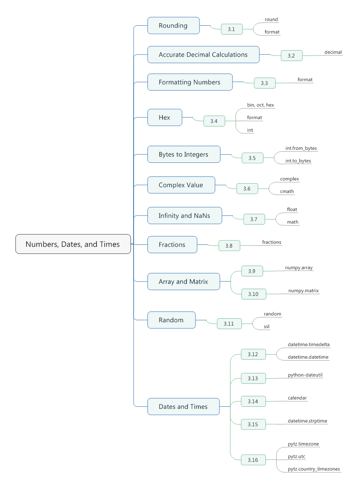

# Chapter03. Numbers, Dates, and Times



## 3.1 Rounding Numerical Values

- Use the build-in *round(value, ndigits)* function.
- When a value is exactly halfway between two choices, the behavior of round is to round to the nearest **even** digit.
- The number of digits(*ndigits*) given to *round()* can be negative, in which case rounding takes places for tens, hundreds, thousands, and so on.
```python
>>> round(1.25361, 3)
1.254
>>> a = 1627731
>>> round(a, -1)
1627730
>>> round(a, -2)
1627700
```

- If your goal is simply to output a numerical value with a certain number of decimal places, you don't typically need to use *round()*.
```python
>>> x = 1.23456
>>> format(x, '0.2f')
'1.23'
```

- Resist the urge to round floating-point numbers to fix perceived problems.

## 3.2 Performing Accurate Decimal Calculations

- Even simple mathematical calculations introduce small errors.
```python
>>> a = 2.1
>>> b = 4.2
>>> c = a + b
>>> c
6.300000000000001
>>> c == 6.3
False
```

- If you want more accuracy, you can use the *decimal* module.
- A major feature of *decimal* is that it allows you to control different aspects of calculations, including number of digits and rounding.
```python
from decimal import Decimal

a = Decimal('4.2')
b = Decimal('2.1')
c = a + b
print(c)
print(c == 6.3)
print(c == Decimal('6.3'))

# 6.3
# False
# True

from decimal import localcontext

a = Decimal('1.3')
b = Decimal('1.7')
print(a / b)
with localcontext() as ctx:
    ctx.prec = 3
    print(a / b)
with localcontext() as ctx:
    ctx.prec = 50
    print(a / b)

# 0.7647058823529411764705882353
# 0.765
# 0.76470588235294117647058823529411764705882352941176
```

- You have to be a little careful with effects due to things such as substractive cancellation and adding large and small number together.
```python
nums = [1.23e+18, 1, -1.23e+18]
print(sum(nums)) # 0.0

import math
print(math.fsum(nums)) # 1.0
```

## 3.3 Formatting Numbers for Output

- To format a single number for output, use the build-in *format()* function.
```python
x = 1234.56789

print(format(x, '0.2f'))
print(format(x, '>10.1f'))
print(format(x, '<10.1f'))
print(format(x, '^10.1f'))
print(format(x, ','))
print(format(x, '0,.1f'))

# 1234.57
#     1234.6
# 1234.6
#   1234.6
# 1,234.56789
# 1,234.6
```

- If you want use exponential notation, change the **f** to an **e** or **E**.
```python
print(format(x, 'e'))
print(format(x, '0.2E'))
# 1.234568e+03
# 1.23E+03
```

- The general form of the width and precision in both cases is **'[<>^]?width[,]?(.digits)'** where **width** and **digits** are integers and **?** signifies optional parts.
- The same format codes are also used in the *.format()* method of strings.
- When the number of digits is restricted, values are rounded away according to the same rules of the *round()* funtion.
- Formatting of values with a thousands separator is not locale aware.

## 3.4 Working with Binary, Octal, and Hexadecimal Integers

- To convert an integer into a binary, octal, or hexadecimal text string, use the *bin()*, *oct()*, or *hex()* functions,respectiveyly.
- Alternatively, you can use the *format()* function if you don't want the *0b*, *0o*, *0x* prefixes to appear.
- If you working with negative numbers, the output will also include a sign.
```python
x = 1234
print(bin(x)) # 0b10011010010
print(oct(x)) # 0o2322
print(hex(x)) # 0x4d2
print(format(x, 'b')) # 10011010010
print(format(x, 'o')) # 2322
print(format(x, 'x')) # 4d2
```

- To convert integer strings in different bases, simple use the *int()* function with an appropriate base.
```python
print(int('4d2', 16)) # 1234
print(int('10011010010', 2)) # 1234
```


## 3.5 Packing and Unpacking Large Integers from Bytes

- To interpret bytes as an integer, use *int.from_bytes()*, and specify the byte ordering like this:
```python
data = b'\x00\x124V\x00x\x90\xab\x00\xcd\xef\x01\x00#\x004'
l = len(data)
print(l)
print(int.from_bytes(data, 'little'))
print(int.from_bytes(data, 'big'))

# 16
# 69120565665751139577663547927094891008
# 94522842520747284487117727783387188
```

- To convert a large integer value back into a byte string, use the *int.to_byte()* method, specifying the number of bytes and the byte order.
```python
x = 94522842520747284487117727783387188
print(x.to_bytes(16, 'big'))
print(x.to_bytes(16, 'little'))

# b'\x00\x124V\x00x\x90\xab\x00\xcd\xef\x01\x00#\x004'
# b'4\x00#\x00\x01\xef\xcd\x00\xab\x90x\x00V4\x12\x00'
```

- As an alternative to this recipe, you might be inclined to unpack values using the *struct* module.
- The specification of teh byte order(*little* or *big*) just indicates whether the bytes that make up the integer value are listed from the least to most significant or the other way around.
- If you try to pack an integer into a byte string, but it won't fit, you'll get an error. You can use the *int.bit_length()* method to determine how many bits are required to store a value if needed.
```python
x = 523 ** 23
print(x)
l = x.bit_length()
print(l)

nbytes, rem = divmod(l, 8)
if rem:
    nbytes +=  1

print(x.to_bytes(nbytes,'little'))

# 335381300113661875107536852714019056160355655333978849017944067
# 208
# b'\x03X\xf1\x82iT\x96\xac\xc7c\x16\xf3\xb9\xcf\x18\xee\xec\x91\xd1\x98\xa2\xc8\xd9R\xb5\xd0'
```

## 3.6 Performing Complex-Valued Math

- Complex numbers can be specified using the *complex(real, imag)* funtion or by floating-point numbers with a *j* suffix.
- The real, imaginary, and conjugate values are easy to obtain.
- All of the usual mathematical operators work.
- To perform additional complex-valued functions such as sines, cosines, or square roots, use the *cmath* module.
- Most of Python's math-related modules are aware of complex value.
- Python's standard mathematical funtions do not produce complex values by default. If you want complex numbers to be produced as a result, you have to explicitly use *cmath* or declare use of a complex type in libraries that know about them.
```python
a = complex(2, 4)
b = 3 -5j
print(a, b) # (2+4j) (3-5j)
print(a.real) # 2.0
print(a.imag) # 4.0
print(a.conjugate()) # (2-4j)
```

## 3.7 Working with Infinity and NaNs

- Infinity, negative infinity or NaN(not a number) can be created using *float()*.
- To test for the presence of these values, use the *math.isinf()* and *math.isnan()* functions.
- Infinite values will propagate in calculations in a mathematical manner.
- Certain operations are undefined and will result in a NaN result.(such as *inf + inf*)
- NaN values propagate through all operations without raising an exception.
- A subtle feature of NaN value is that they never compare as equal.
```python
a = float('inf')
b = float('-inf')
c = float('nan')

import math
print(math.isinf(a)) # True
print(math.isinf(b)) # True
print(math.isnan(c)) # True
```

## 3.8 Calculating with Fractions

- The *fractions* module can be used to perform mathematical calculations involving fractions.
```python
from fractions import Fraction
a = Fraction(5, 4)
b = Fraction(7, 16)
print(a + b) # 27/16
print(a * b) # 35/64
# Getting numerator/denominator
c = a * b
print(c.numerator) # 35
print(c.denominator) # 64
# Converting to a float
print(float(c)) # 0.546875
# Limiting the denominator of a value
print(c.limit_denominator(8)) # 4/7
# Converting a float to a fraction
x = 3.75
y = Fraction(*x.as_integer_ratio())  
print(y) # 15/4
```

## 3.9 Calculating with Large Numerical Arrays

- For any heavy computation involving arrays, use the *NumPy library*.
- Scalar operations apply the operation on an element-by-element basis.
- Performing math operations when both operands are arrays applies the operation to all elements and produced a new array.
```python
import numpy as np
ax = np.array([1, 2, 3, 4])
ay = np.array([5, 6, 7, 8])
print(ax * 2)
print(ax + 10)
print(ax + ay)
print(ax * ay)

# [2 4 6 8]
# [11 12 13 14]
# [ 6  8 10 12]
# [ 5 12 21 32]
```

- Compute the value of a polynomial。
```python
def f(x):
    return 3*x**2 - 2*x +7

print(f(ax)) # [ 8 15 28 47]
```

- *Numpy* provides a collection of "universal functions" that allow for array operations.
```python
print(np.sqrt(ax)) # [ 1.          1.41421356  1.73205081  2.        ]
print(np.cos(ax))  # [ 0.54030231 -0.41614684 -0.9899925  -0.65364362]
```

- *NumPy array* are allocated in the same manner in C or Fortran. Namely, the are large, contiguous memory regions consisting of a homogenous data type.
- Because of this, it's possible to make arrays much large than anything you would normally put into a *Python list*.
```python
grid = np.zeros(shape = (10000, 10000), dtype = float)
print(grid)
grid += 10
print(grid)

# [[ 0.  0.  0. ...,  0.  0.  0.]
#  [ 0.  0.  0. ...,  0.  0.  0.]
#  [ 0.  0.  0. ...,  0.  0.  0.]
#  ..., 
#  [ 0.  0.  0. ...,  0.  0.  0.]
#  [ 0.  0.  0. ...,  0.  0.  0.]
#  [ 0.  0.  0. ...,  0.  0.  0.]]
# [[ 10.  10.  10. ...,  10.  10.  10.]
#  [ 10.  10.  10. ...,  10.  10.  10.]
#  [ 10.  10.  10. ...,  10.  10.  10.]
#  ..., 
#  [ 10.  10.  10. ...,  10.  10.  10.]
#  [ 10.  10.  10. ...,  10.  10.  10.]
#  [ 10.  10.  10. ...,  10.  10.  10.]]
```

- One extremely notable aspect of *NumPy* is the manner in which it extends *Python's list* indexing functionality -- especially with multidimensional arrays.
```python
import numpy as np
a = np.array([[1, 2, 3, 4], [5, 6, 7, 8], [9, 10 ,11, 12]])
print(a)
# [[ 1  2  3  4]
#  [ 5  6  7  8]
#  [ 9 10 11 12]]

# Select row 1
print(a[1]) # [5 6 7 8]
# Select column 1
print(a[:, 1]) # [5 6 7 8]
# Select a subregion and change it
print(a[1:3, 1:3])
a[1:3, 1:3] += 10
print(a)
# [[ 6  7]
#  [10 11]]
# [[ 1  2  3  4]
#  [ 5 16 17  8]
#  [ 9 20 21 12]]

# Broadcast a row vector across an operation on all rows
print(a + [100, 101, 102, 103])
# [[101 103 105 107]
#  [105 117 119 111]
#  [109 121 123 115]]

# Conditional assignment on array
print(np.where(a < 10, a, 10))
# [[ 1  2  3  4]
#  [ 5 10 10  8]
#  [ 9 10 10 10]]
```

- For more information, you definately need to visit [website](htttp://www.numpy.org)

## 3.10 Performing Matrix and Linear Algebra Calculations

- The *NumPy library* has a *matrix* object that can be used for this purpose.
- Matrices are somewhat similar to the array objects described in *Recipe 3.9*, but follow linear algebra rules for computation.
```python
import numpy as np
m = np.matrix([[1, -2, 3], [0, 4, 5], [7, 8, -9]])
print(m)
# [[ 1 -2  3]
#  [ 0  4  5]
#  [ 7  8 -9]]

# Return transpose
print(m.T)
# [[ 1  0  7]
#  [-2  4  8]
#  [ 3  5 -9]]

# Return inverse
print(m.I)
# [[ 0.33043478 -0.02608696  0.09565217]
#  [-0.15217391  0.13043478  0.02173913]
#  [ 0.12173913  0.09565217 -0.0173913 ]]

# Create a vector and multiply
v = np.matrix([[2], [3], [4]])
print(v)
print(m * v)
# [[2]
#  [3]
#  [4]]
# [[ 8]
#  [32]
#  [ 2]]
```

- More operations can be found in the *numpy.linalg* subpackage. For example:
 + Determinant --> `np.linalg.det(m)`
 + Eigenvalues --> `np.linalg.eigvals(m)`
 + Solve for x in mx = v --> `np.linalg.solve(m, v)`

## 3.11 Picking Things at Random

- The *random* module has various functions for random numbers and picking random items.
- To pick a random item out of a sequence, use *random.choice()*.
- To take a simpling of N items, use *random.sample()* instead.
- If you simply want to shuffle items in sequence in place, use *random.shuffle()*.
- To produce random integers, use *random.randint()*.
- To produce uniform floating-point values in the range 0 to 1, use *random.random()*.
- To get N random-bits expressed as an integer, use *random.getrandbits()*.
```python
import random
values = [1, 2, 3, 4, 5, 6]
print(random.choice(values))
print(random.sample(values, 2))
random.shuffle(values)
print(values)
print(random.randint(0, 10))
print(random.random())
print(random.getrandbits(200))
```

- In addition to the functionality shown, *random* includes functions for *uniform*, *Gaussian*, and other probabality distributions.
- Functions in *random* should not be used in programs related to cryptography. If you need such functionality, consider using functions in the *ssl* module instead.

## 3.12 Converting Days to Seconds, and Other Basic Time

- To perform conversions and arithmetic involving different units of time, use the *datetime* module.
- To represent an interval of time, create a *timedelta* instance.
```python
from datetime import timedelta
a = timedelta(days = 2, hours = 6)
b = timedelta(hours = 4.5)
c = a + b
print(c.days) # 2
print(c.seconds) # 37800
print(c.seconds / 3600) # 10.5
print(c.total_seconds() / 3600) # 58.5
```

- If you need to represent specific dates and times, create *datetime* instances and use the standard mathematical operations to manipulate them.
```python
from datetime import timedelta
from datetime import datetime
a = datetime(2016, 11, 3)
print(a + timedelta(days = 10)) # 2016-11-13 00:00:00
b = datetime(2015, 12, 31)
d = a - b
print(d.days) # 308
now = datetime.today()
print(now) # 2016-11-03 12:05:18.093737
print(now + timedelta(minutes = 10)) # 2016-11-03 12:15:18.093737s
```

- When making calculations, it should be noted that *datetime* is aware of leap years.
- If you need to perform more complex date manipulations, such as dealing with time zones, fuzzy time ranges, calculating the dates of holidays, and so forth, look at the *dateutil* module.

## 2.13 Determining Last Friday's Date

- If you want a general solution for finding a date for the last occurrence of a day the week, python's *datetime* module has utility functions and classes to help perform calculations like this.
```python
from datetime import datetime, timedelta

weekdays = ['Monday', 'Tuesday', 'Wednesday', 'Thursday', 'Friday', 'Saturaday', 'Sunday']

def get_previous_byday(dayname, start_date = None):
    if start_date is None:
        start_date = datetime.today()
    day_num = start_date.weekday()
    day_num_target = weekdays.index(dayname)
    days_ago = (7 + day_num - day_num_target) % 7
    if days_ago == 0:
        days_ago == 7
    target_date = start_date - timedelta(days = days_ago)
    return target_date

print(datetime.today())
print(get_previous_byday('Friday'))
print(get_previous_byday('Monday'))
print(get_previous_byday('Wednesday'))

# 2016-11-03 13:34:44.587284
# 2016-10-28 13:34:44.587284
# 2016-10-31 13:34:44.587284
# 2016-11-02 13:34:44.587284
```

- If you're performing a lot of date calculations like this, you may be better off installing the *python-dateutil*.
- Here is an example of performing the same calculation using the *relativedelta()* function from *dateutil*.
```python
from datetime import datetime
from dateutil.relativedelta import relativedelta
from dateutil.rrule import *
d = datetime.now()
print(d)
print(d + relativedelta(weekday = FR))
print(d + relativedelta(weekday = FR(-1)))

# 2016-11-03 13:58:19.558437
# 2016-11-04 13:58:19.558437
# 2016-10-28 13:58:19.558437
```

## 3.14 Finding the Date Range for the Current Month

- Looping over the dates doesn't require building a list of all the dates ahead of time. You can just calculate the starting and stopping day in the range, then use datetime.timedelta objects to increment the date as you go.
```python
from datetime import datetime, date, timedelta
import calendar

def get_month_range(start_date = None):
    if start_date is None:
        start_date = date.today().replace(day = 1)
    _, days_in_month = calendar.monthrange(start_date.year, start_date.month)
    end_date = start_date + timedelta(days = days_in_month)
    return (start_date, end_date)

a_day = timedelta(days = 1)
first_day, last_day = get_month_range()
while first_day < last_day:
    print(first_day)
    first_day += a_day

# 2016-11-01
# 2016-11-02
# 2016-11-03
# 2016-11-04
# 2016-11-05
# ..........
```

- Ideally, it would be nice to create a function that works like the built-in *range()* function, but for dates.
```python
from datetime import datetime, timedelta

def date_range(start, stop, step):
    while start < stop:
        yield start
        start += step

for d in date_range(datetime(2016, 1, 18), datetime(2016, 4, 5), timedelta(hours = 6)):
    print(d)

# 2016-01-18 00:00:00
# 2016-01-18 06:00:00
# 2016-01-18 12:00:00
# 2016-01-18 18:00:00
# 2016-01-19 00:00:00
# ...................
```

## 3.15 Converting Strings into Datetimes

- The standard *datetime* module is typically the easy solution for this.
- The *datetime.strptime()* method supports a host of formatting codes.
```python
from datetime import datetime

text = '2016-01-18'
y = datetime.strptime(text, '%Y-%m-%d')
z = datetime.now()
diff = z - y
print(diff) # 290 days, 14:28:29.102109
```

## 3.16 Manipulating Dates Involving Time Zones

- For almost any problems involving time zones, you should use the *pytz* module.
```python
from datetime import datetime
from pytz import timezone

d = datetime.now()
print(d) # 2016-11-03 14:42:47.690513

central = timezone('US/Central')
loc_d = central.localize(d)
print(loc_d) # 2016-11-03 14:42:47.690513-05:00
```

- To keep your head from completely exploding, a common strategy for localized date handling  is to convert all dates to UTC time and use that for all internal storage and manipulation.
```python
from datetime import datetime
from pytz import timezone
import pytz

d = datetime.now()
print(d)

central = timezone('US/Central')
loc_d = central.localize(d)
print(loc_d)

utc_d = loc_d.astimezone(pytz.utc)
print(utc_d)

# 2016-11-03 14:54:47.281902
# 2016-11-03 14:54:47.281902-05:00
# 2016-11-03 19:54:47.281902+00:00
```

- To find out what time zone names to use, you can Consult the *pytz.country_timezones* dictionary using the *ISO 3166 country code* as a key.
```python
import pytz
print(pytz.country_timezones['CN'])
# ['Asia/Shanghai', 'Asia/Urumqi']
```
