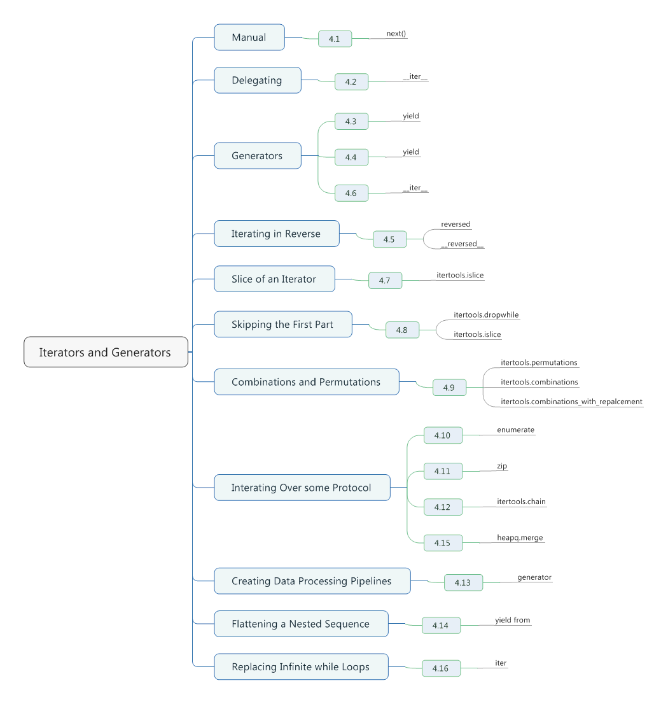

# Chapter04. Iterators and Generators



## 4.1 Manually Consuming an Iterator

- To manually consume an iterable, use the *next()* function and write your code to catch the *StopIteration* exception.
- You can also instruct it to return it to a terminating value, such as *None* instead.
```python
with open('example.py') as f: # must be a file, cannot be a folder
    try:
        while True:
            line = next(f)
            print(line, end = '')
    except StopIteration:
        pass
```

- The following interactive example illustrate the basic mechanics of what happens during iteration.
```python
items = [1 ,2 ,3]
# Get the iterator. Invokes items.__iter__()
it = iter(items)
# Run the iterator. Invokes it.__next__()
print(next(it))
print(next(it))
print(next(it))
print(next(it))

# 1
# 2
# 3
# Traceback (most recent call last):
#   File "F:\Learning\Python\Cookbook\test.py", line 8, in <module>
#     print(next(it))
```

## 4.2 Delegating Iteration

- You would like to make iteration work with your new container, all you need to do is define an `__iter__()` method that delegates iteration to the internally held container.
- Python's iterator protocal requires `__iter__()` to return a special iterator object that implements a `__next__()` method to carry out the actual iteration.
```python
class Node:
    def __init__(self, value):
        self._value = value
        self._children = []

    def __repr__(self):
        return 'Node({!r})'.format(self._value)

    def add_child(self, node):
        self._children.append(node)

    def __iter__(self):
        return iter(self._children)

if __name__ == '__main__':
    root = Node(0)
    child1 = Node(1)
    child2 = Node(2)
    root.add_child(child1)
    root.add_child(child2)
    for ch in root:
        print(ch)

# Node(1)
# Node(2)
```

## 4.3 Creating New Iteration Patterns with Genertors

- Here's a generator that produces a range of floating-point numbers
```python
def frange(start, stop, increment):
    x = start
    while x < stop:
        yield x
        x += increment

print(list(frange(0, 1, 0.125))) # [0, 0.125, 0.25, 0.375, 0.5, 0.625, 0.75, 0.875]
```

- The mere presence of the *yield* statement in a function turns it into a generator. Unlike a normal function, a generator only runs in response to iteration.
- Here's an experiment you can try to see the underlying mechanics of how such a function works.
```python
>>> def countdown(n):
    print('Starting to count from', n)
    while n > 0:
        yield n
        n -= 1
    print('Done!')

    
>>> c = countdown(3)
>>> c
<generator object countdown at 0x022DDF90>
>>> next(c)
Starting to count from 3
3
>>> next(c)
2
>>> next(c)
1
>>> next(c)
Done!
Traceback (most recent call last):
  File "<pyshell#12>", line 1, in <module>
    next(c)
StopIteration
```

## 4.4 Implementing the Iterator Protocol

- By far, the easiest way to implement iteration on an object is to use a generator function.
```python
# Implement an iterator that traverses nodes in a depth-first pattern.
class Node:
    def __init__(self, value):
        self._value = value
        self._children = []

    def __repr__(self):
        return 'Node({!r})'.format(self._value)

    def add_child(self, node):
        self._children.append(node)

    def __iter__(self):
        return iter(self._children)

    def depth_first(self):
        yield self
        for c in self:
            yield from c.depth_first()

if __name__ == '__main__':
    root = Node(0)
    child1 = Node(1)
    child2 = Node(2)
    root.add_child(child1)
    root.add_child(child2)
    child1.add_child(Node(3))
    child1.add_child(Node(4))
    child2.add_child(Node(5))
    for ch in root.depth_first():
        print(ch)

# Node(0)
# Node(1)
# Node(3)
# Node(4)
# Node(2)
# Node(5)
```

## 4.5 Iterating in Reverse

- Use the built-in *reversed()* function.
- Reversed iteration only works if the object in question has a size that can be determined or if the object implements a `__reversed__()` special method.
- If neither of these can satisfied, you'll have to convert the object into a list first.
```python
a = [1, 2, 3, 4]
for x in reversed(a):
    print(x)

# 4
# 3
# 2
# 1
```

- Reversed iteration can be customized on user-defined classes if they implement the `__reversed__()` method.
```python
class Countdown:
    def __init__(self, start):
        self.start = start

    def __iter__(self):
        n = self.start
        while n > 0:
            yield n
            n -= 1

    def __reversed__(self):
        n = 1
        while n <= self.start:
            yield n
            n += 1

cd = Countdown(5)
for x in reversed(cd):
    print(x)

# 1
# 2
# 3
# 4
# 5
```

## 4.6 Defining Generator Functions with Extra State

- If you want a generator to expose extra state to the user, don't forget that you can easily implement it a class, putting the generator function code in the `__iter__()` method.
```python
from collections import deque

class linehistory:
    def __init__(self, lines, histlen = 3):
        self.lines = lines
        self.history = deque(maxlen = histlen)

    def __iter__(self):
        for lineno, line in enumerate(self.lines, 1):
            self.history.append((lineno, line))
            yield line

    def clear(self):
        self.history.clear()

with open('somefile.txt') as f:
    lines = linehistory(f)
    for line in lines:
        if 'python' in line:
            for lineno, hline in lines.history:
                print('{}: {}'.format(lineno, hline), end = '')

# 1: Hello, python!
# 1: Hello, python!
# 2: Bye, python!
# 1: Hello, python!
# 2: Bye, python!
# 3: Have a nice day, python!
# 2: Bye, python!
# 3: Have a nice day, python!
# 4: I'm so upset, python!
# 3: Have a nice day, python!
# 4: I'm so upset, python!
# 5: I want leave, python!
# 4: I'm so upset, python!
# 5: I want leave, python!
# 6: I'm a loser, python!
```

## 4.7 Taking a Slice of an Iterator

- Iterators and generators can't normally be sliced, because no information is known about their length.
- The *itertools.islice()* function is perfectly suited for taking slices of iterators and generators.
- It is important to emphasize that *islice()* will consume data on the supplied iterator. Since iterators can't be rewound, that is something to consider.
```python
def count(n):
    while True:
        yield n
        n += 1

c = count(0)

import itertools
for x in itertools.islice(c, 10, 20): # amount to c[10: 20]
    print(x)

# 10
# 11
# 12
# 13
# 14
# 15
# 16
# 17
# 18
# 19
```

## 4.8 Skipping the First Part of an Iterable

- The *itertools* module has a few functions that can be used to address this task.
- The first is *itertools.dropwhile()* function. To use it, you supply a function and an **iterable**.
```python
from itertools import dropwhile
with open('somefile.txt') as f:
    # skip all of the initial comment lines
    for line in dropwhile(lambda line: line.startswith('#'), f):
        print(line, end = '')
```

- If you happen to know the exact number of items you want to skip, then use *itertools.islice()* instead.
- The last *None* argument to *islice()* is required to indicate that you want everything **beyond** the first three items as opposed to only the first three items.
```python
from itertools import islice
items = ['a', 'b', 'c', 1, 4, 10, 15]
for x in islice(items, 3, None):
    print(x)

# 1
# 4
# 10
# 15
```

## 4.9 Iterating Over All Possible Combinations or Permutations

- The *itertools* module provides three functions for this task.
- The first of these -- *itertools.permutations()* -- takes a collection of items and produces a sequence of tuples that rearranges all of the items into all possible permutations.
- If you want all permutations of a smaller length, you can give an optional length argument.
```python
items = ['a', 'b', 'c']
from itertools import permutations
for p in permutations(items):
    print(p)

# ('a', 'b', 'c')
# ('a', 'c', 'b')
# ('b', 'a', 'c')
# ('b', 'c', 'a')
# ('c', 'a', 'b')
# ('c', 'b', 'a')

for p in permutations(items, 2):
    print(p)

# ('a', 'b')
# ('a', 'c')
# ('b', 'a')
# ('b', 'c')
# ('c', 'a')
# ('c', 'b')
```

- Use *itertools.combinations()* to produce a sequence of combinations of items taken from the input.
- When producing combinations, chosen items are removed from the collection of possible candidates.
- The *itertools.combinations_with_replacement()* function relaxes this, and allows the same item to be chosen more than once.
```python
items = ['a', 'b', 'c']
from itertools import *
for p in combinations(items, 3):
    print(p)

# ('a', 'b', 'c')

for p in combinations(items, 2):
    print(p)

# ('a', 'b')
# ('a', 'c')
# ('b', 'c')

for c in combinations_with_replacement(items, 3):
    print(c)

# ('a', 'a', 'a')
# ('a', 'a', 'b')
# ('a', 'a', 'c')
# ('a', 'b', 'b')
# ('a', 'b', 'c')
# ('a', 'c', 'c')
# ('b', 'b', 'b')
# ('b', 'b', 'c')
# ('b', 'c', 'c')
# ('c', 'c', 'c')
```

## 4.10 Iterating Over the Index-Value Pairs of a Sequence

- The built-in *enumerate()* function handles this quite nicely.
- For printing output with canonical line numbers(where you typically start the numbering at 1 instead of 0), you can pass in a *start* argument.
```python
my_list = ['a', 'b', 'c']
for idx, val in enumerate(my_list):
    print(idx, val)

# 0 a
# 1 b
# 2 c

for idx, val in enumerate(my_list, 1):
    print(idx, val)

# 1 a
# 2 b
# 3 c
```

- *enumerate()* can be handy for keeping track of the offset into a list for occurrences of certain values.
```python
from collections import defaultdict
word_summary = defaultdict(list)

with open('somefile.txt', 'r') as f:
    lines = f.readlines()

for idx, line in enumerate(lines):
    words = [w.strip().lower() for w in line.split()]
    for word in words:
        word_summary[word].append(idx)

for key, value in word_summary.items():
    print('{:<8}: {}'.format(key, value))

# day,    : [4]
# have    : [4]
# a       : [0, 4, 7]
# python! : [2, 3, 4, 5, 6, 7]
# bye,    : [3]
# test    : [0]
# so      : [5]
# this    : [0]
# skip    : [1]
# leave,  : [6]
# want    : [6]
# use     : [1]
# to      : [1]
# is      : [0]
# hello,  : [2]
# file.   : [0]
# nice    : [4]
# loser,  : [7]
# upset,  : [5]
# i'm     : [5, 7]
# i       : [6]
# #       : [0, 1]
```

- Although a minor point, it's worth mentioning that sometimes it is easy to get tripped up when applying *enumerate()* to a sequences of tuples that are also being unpacked.

## 4.11 Iterating Over Multiple Sequences Simultaneously

- To iterate over more than one sequence simultaneously, use the *zip()* function.
- *zip(a, b)* works by creating an iterator that produces *(x, y)* where *x* is taken from *a* and *y* taken from *b*.
- Iteration stops whenever one of the input sequences is exhausted. If this behavior is not desired, use *itertools.zip_longest()* instead.
- It's important to emphasize that *zip()* creates an iterator as a result.
```python
xpts = [1, 5, 4, 2, 10, 7]
ypts = [101, 78, 37, 15, 62, 99]
for x,y in zip(xpts, ypts):
    print(x, y)

# 1 101
# 5 78
# 4 37
# 2 15
# 10 62
# 7 99
```

## 4.12 Iterating on Items in Separate Containers

- The *itertools.chain()* method can be used to simplify this task. It takes a list of iterables as input, and returns an iterator that effectively masks the fact that you're really acting on multiple containers.
- *itertools.chain()* accepts one or more iterables as arguments.
```python
from itertools import chain

a = [1, 2, 3, 4]
b = ['x', 'y', 'z']
for x in chain(a, b):
    print(x)

# 1
# 2
# 3
# 4
# x
# y
# z
```

## 4.13 Creating Data Processing Pipelines

- Generator functions are a good way to implement processing piplines.
```python
# To process these files, you could define a collection of small generator functions that perform specific self-contained tasks.
import os
import fnmatch
import gzip
import bz2
import re

def gen_find(filepat, top):
    '''
    Find all filenames in a directory tree that match a shell wildcard pattern
    '''
    for path, dirlist, filelist in os.walk(top):
        for name in fnmatch.filter(filelist, filepat):
            yield os.path.join(path, name)

def gen_opener(filenames):
    '''
    Open a sequence of filenames one at a time producing a file object.
    The file is closed immediately when proceeding to next iteration.
    '''
    for filename in filenames:
        if filename.endwith('.gz'):
            f = gzip.open(filename, 'rt')
        elif filename.endwith('bz2'):
            f = bz.open(filename, 'rt')
        else:
            f = open(filename,'rt')
        yield f
        f.close()

def gen_concatenate(iterators):
    '''
    Chain a sequence of iterators together into a single sequence.
    '''
    for it in iterators:
        yield from it

def gen_grep(pattern, lines):
    '''
    Look for a regex pattern in a sequence of lines.
    '''
    pat = re.compile(pattern)
    for line in lines:
        if pat.search(line):
            yield line
```

- Consult [that](http://www.dabeaz.com) for even more examples.

## 4.14 Flattening a Nested Sequence 

- This is easily solved by writing a recursive generator function involving *yield from* statement.
- The *yield from* statement is a nice shortcut to use if you ever want to write generators that call other generators as subroutines.
```python
from collections import Iterable

def flatten(items, ignore_types = (str, bytes)):
    for x in items:
        if isinstance(x, Iterable) and not isinstance(x, ignore_types):
            yield from flatten(x)
        else:
            yield x

items = [1, 2, [3, 4, [5, 6], 7], 8]

for x in flatten(items):
    print(x)

# 1
# 2
# 3
# 4
# 5
# 6
# 7
# 8
```

- As noted, the extra check for strings and bytes is there to prevent the expansion of those types into individual characters.

## 4.15 Iterating in Sorted Order Over Merged Sorted Iterables

- The *heapq.merge()* function does exactly what you want.
- It's important to emphasize that *heapq.merge()* requires that all of the input sequences already be sorted.
- It simply examines the set of items from the front of each input sequence and emits the smallest on found. A new item from the chosen sequence is then read, and the prcess repeats itself until all input sequences have benn fully consumed.
```python
import heapq
a = [1, 4, 7, 10]
b = [2, 5, 6, 11]
for c in heapq.merge(a,b):
    print(c)

# 1
# 2
# 4
# 5
# 6
# 7
# 10
# 11
```

## 4.16 Replacing Infinite while Loops with an Iterator

- A somewhat common scenario in programs involving I/O is to write code like this:
```python
CHUNKSIZE = 8192

def reader(s):
    while True:
        data = s.recv(CHUNKSIZE)
        if data == b'':
            break
        process_data(data)
```

- Such code can often be replaced using *iter()*
- A little-known feature of the built-in *iter()* function is that it optionally accepts a zero-argument callable and **sentinel** value as inputs.
```python
def reader(s):
    for chunk in iter(lambda: s.recv(CHUNKSIZE), b''):
        process_data(data)
```
