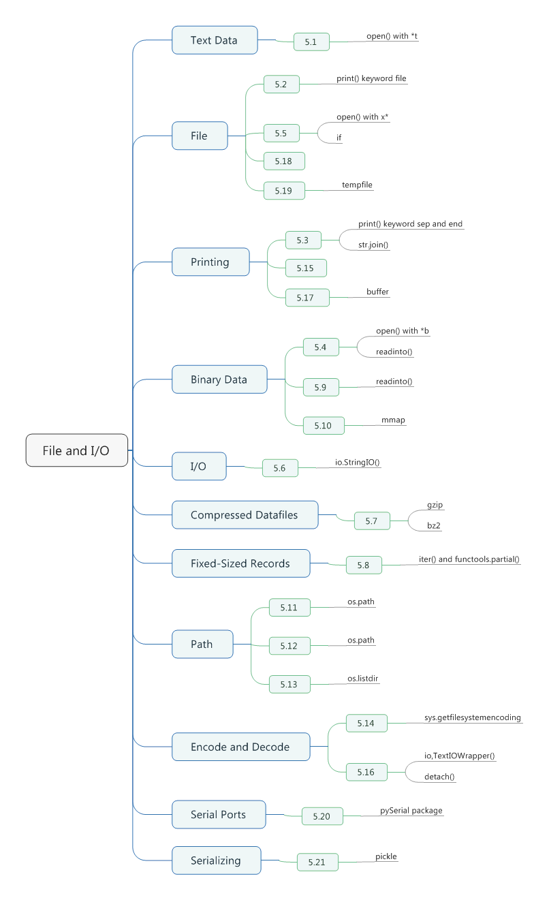
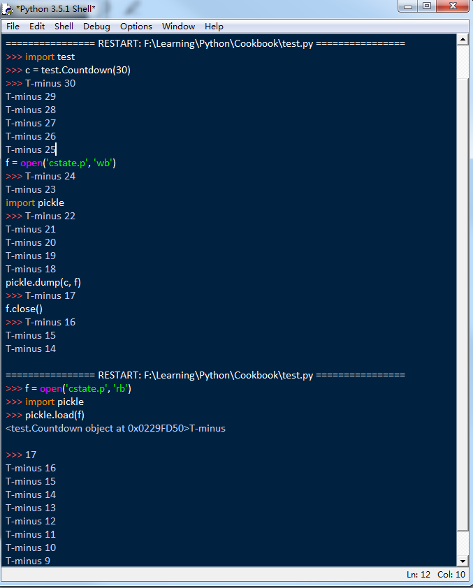

# Chapter 05. File and I/O



## 5.1 Reading and Writing Text Data

- Use the *open()* function with mode *rt* to read text file.
- Use the *open()* with mode *wt* to write a file, clearing and overwriting the previous contents(if any).
- To append to the end of an existing file, use *open()* with mode *at*.
- Files are read/written using the system default text encoding, as can be found in *sys.getdefaultencoding()*.
- If you know that the text you are reading or writing is in a different encoding, supply the optional *encoding* parameter to *open()*.
```python
with open('somefile.txt', 'rt') as f:
    pass
with open('somefile.txt', 'wt') as f:
    pass
with open('somefile.txt', 'rt', encoding = 'latin-1') as f:
    pass
```

- If you don't use *with* statement, make sure you remember to close the file.
- All common newline conventions are recognized, and newline characters are converted to a single "\n" character while reading. If you don't want this translation, supply the *newline = ''* argument to *open()*.

## 5.2 Printing to a File

- Use the *file* keyword argument to *print()*.
```python
with open('somefile.txt', 'at') as f:
    print('I wanna kiss you!', file = f)
```

## 5.3 Printing with a Different Separator or Line Ending

- Use the *sep* and *end* keyword argument to *print()* to change the output as you wish.
```python
print('ACME', 50, 91.5)
print('ACME', 50, 91.5, sep = ',')
print('ACME', 50, 91.5, sep = ',', end = '!!\n')

# ACME 50 91.5
# ACME,50,91.5
# ACME,50,91.5!!
```

- Sometimes you'll see programmers using *str.join()* to accomplish the same thing.
- The problem with *str.join()* is that it only works with strings.
```python
print(','.join(('ACME', '50', '91.5')))
# ACME,50,91.5
```

## 5.4 Reading and Writing Binary Data

- Use the *open()* function with mode *rb* or *wb* to read or write binary data.
```python
with open('somefile.txt', 'rb') as f:
    data = f.read()
with open('somefile.txt', 'wb') as f:
    f.write(b'Hello World')
```

- If you ever need to read or write text from a binary-mode file, make sure remember to decode or encode it.
```python
with open('somefile.txt', 'rb') as f:
    data = f.read(16)
    text = data.decode('utf-8')
    print(text)
with open('somefile.txt', 'wb') as f:
    text = 'Hello World'
    f.write(text.encode('utf-8'))
```

- A lesser-known aspect of binary I/O is that objects such as arrays and C structures can be used for writing without any kind of intermediate conversion to a bytes object.
- This applies to any object that implements the so-called "buffer interface", which directly exposes an underlying memory buffer to operations that can work with it.
```python
import array
nums = array.array('i', [1, 2, 3, 4])
with open("somefile.bin", 'wb') as f:
    f.write(nums)
# 0100 0000 0200 0000 0300 0000 0400 0000
```

- Many objects also allow binary data to be directly read into their underlying memory using the *readinto()* method of files.
```python
import array
nums = array.array('i', [0, 0, 0, 0])
with open("somefile.bin", 'rb') as f:
    f.readinto(nums)
print(nums) # array('i', [1, 2, 3, 4])
```

## 5.5 Writing to a File That Doesn't Already Exist

- You want to write data to a file, but only if it doesn't already exist on the filesystem.
- This problem is easily solved by using the little-known *x* mode to *open()* instead of the usual *w* mode.
- An alternative solution is to first test for the file like this:
```python
import os
if not os.path.exists('somefile'):
    with open('somefile', 'wt') as f:
        f.write('hello\n')
    else:
        print('File already exists!')
```

## 5.6 Performing I/O Operations on a String

- Using the *io.StringIO()* and *io.BytesIO()* classes to create file-like objects that operate on string data.
- Be aware that *StringIO* and *BytesIO* instances don't have a proper integer file-descriptor.
```python
>>> import io
>>> s = io.StringIO()
>>> s.write('Hello World\n')
12
>>> print('This is a test', file = s)
>>> # Get all of the data written so far
>>> s.getvalue()
'Hello World\nThis is a test\n'
>>> # Wrap a file interface around an existing string
>>> s = io.StringIO('Hello\nWorld\n')
>>> s.read(4)
'Hell'
>>> s.read()
```

## 5.7 Reading and Writing Compressed Datafiles

- The *gzip* and *bz2* modules make it easy to work with such files. Both modules provide an alternative implementation of *open()* that can be used for the purpose.
- Both *gzip.open()* and *bz2.open()* accept the same parameters as build-in *open()* function, include *encoding, errors, newline*, and so forth.

## 5.8 Iterating Over Fixed-Sized Records

- Use the *iter()* function and *functools.partial()* using this neat trick.
- A little-known feature of the *iter()* function is that it can create an iterator if you pass it a callable and a snentinel value. The resulting iteratro simply calls the supplied callable over and over again until it returns the sentinel, at which point iteration stops.
```python
from functools import partial

RECORD_SIZE = 32

with open('somefile.data', 'rb') as f:
    records = iter(partial(f.read, RECORD_SIZE), b'')
    for r in records:
        pass
```

## 5.9 Reading Binary Data into a Mutable Buffer

- To read data into a mutable array, use the *readinto()* method of files.
```python
import os.path

def read_into_buffer(filename):
    buf = bytearray(os.path.getsize(filename))
    with open(filename, 'rb') as f:
        f.readinto(buf)
    return buf

with open('somefile.bin', 'wb') as f:
    f.write(b'Hello World')

buf = read_into_buffer('somefile.bin')
print(buf) # bytearray(b'Hello World')
```

- Another interesting feature to use here might be a memoryview, which lets you make zero-copy slices of an existing buffer and even change its contents.

## 5.10 Memory Mapping Binary Files

- Use the *mmap* module to memory map files.
- Using *mmap* to map files into memory can be an efficient and elegant means for randomly accessing the contents of a file.
```python
import os
import mmap

def memory_map(filename, access = mmap.ACCESS_WRITE):
    size = os.path.getsize(filename)
    fd = os.open(filename, os.O_RDWR)
    return mmap.mmap(fd, size, access = access)

size = 1000000
with open('data', 'wb') as f:
    f.seek(size - 1)
    f.write(b'\x00')

m = memory_map('data')
print(len(m))
print(m[1:10])
print(m[0])
m[0:11] = b'Hello World'
m.close()

with open('data', 'rb') as f:
    print(f.read(11))
```

## 5.11 Manipulating Pathnames

- To manipulate pathnames, use the functions in the *os.path* module.
```python
import os
path = 'E:\\AndroidWorkplace\\LockScreenDemo.zip'

print(os.path.basename(path))
print(os.path.dirname(path))
print(os.path.join('D:', 'Programs', os.path.basename(path)))

path = '~\\Data\\data.db'
print(os.path.expanduser(path))
print(os.path.splitext(path))

# LockScreenDemo.zip
# E:\AndroidWorkplace
# D:Programs\LockScreenDemo.zip
# C:\Users\jin.qu\Data\data.db
# ('~\\Data\\data', '.db')
```

## 5.12 Testing for the Existence of a File

- Use the *os.path()* module to test for the existence of a file or directory.
```python
import os
print(os.path.exists('D:\\Android')) # True
print(os.path.exists('E:\\Android')) # False

print(os.path.isfile('D:\\Android')) # False
print(os.path.isdir('D:\\Android'))  # True

print(os.path.getsize('D:\\Programs\\Python\\Python35-32\\NEWS.txt'))  # 310468
print(os.path.getmtime('D:\\Programs\\Python\\Python35-32\\NEWS.txt')) # 1449354720.0

import time
print(time.ctime(os.path.getmtime('D:\\Programs\\Python\\Python35-32\\NEWS.txt'))) # Sun Dec  6 06:32:00 2015
```

## 5.13 Getting a Directory Listing

- Use the *os.listdir()* function to obtain a list of files in a directory
- If you need to filter the data in some way, consider using a list comprehension combined with various functions in the *os.path* library.
- The *startwith()* and *endwith()* methods of strings can be useful for filtering the contents of a directory as well.
- For filename matching, you may want to use the *glob* or *fnmatch* modules instead.
```python
>>> import os
>>> names = [name for name in os.listdir('F:\\work\\SMR\\SecurityPatch') if os.path.isdir(os.path.join('F:\\work\\SMR\\SecurityPatch', name))]
>>> names
['ChangeNotes', 'ReleaseNotes']
```

## 5.14 Bypassing Filename Encoding

- By default, all filenames are encoded and decoded according to the text encoding returned by *sys.getfilesystemencoding()*.
```python
>>> import sys
>>> sys.getfilesystemencoding()
'mbcs'
```

## 5.15 Printing Bad Filenames

- When printing filenames of unknown origin, use this convention to avoid errors.
```python
def bad_filename(filename):
    return repr(filename)[1:-1]

try:
    print(filename)
except UnicodeEncodeError:
    print(bad_filename(filename))
```

- The choice of what to do for the *bad_filename()* function is largely up to you. Another option is to re-encode the value in some way.
```python
def bad_filename(filename):
    temp = filename.encode(sys.getfilesystemencoding(), errors = 'surrogateescape')
    return temp.decode('latin-1')
```

## 5.16 Adding or Changing the Encoding of an Already Open File

- If you want to add Unicode encoding/decoding to an already existing file object that's opened in **binary mode**, wrap it with and *io.TextIOWrapper()* object.
```python
import urllib.request
import io

u = urllib.request.urlopen('http://www.python.org')
f = io.TextIOWrapper(u, encoding = 'utf-8')
text = f.read()
```

- If you want to change the encoding of an already open **text-mode** file, use its *detach()* method to remove the existing text encoding layer before replacing it with a new one.
```python
import sys
import io
print(sys.stdout.encoding) # utf-8
sys.stdout = io.TextIOWrapper(sys.stdout.detach(), encoding = 'latin-1')
print(sys.stdout.encoding) # latin-1
```

- The I/O system is built as a series of layers. You can see the layers yourself by trying this simple example involving a text file.
```python
f = open('somefile.txt', 'w')
print(f)
print(f.buffer)
print(f.buffer.raw)

# <_io.TextIOWrapper name='somefile.txt' mode='w' encoding='cp936'>
# <_io.BufferedWriter name='somefile.txt'>
# <_io.FileIO name='somefile.txt' mode='wb' closefd=True>
```

## 5.17 Writing Bytes to a Text File

- Simply write the byte data to the files underlying buffer. But attribute 'buffer' have been removed in python 3.5
```python
>>> import sys
>>> sys.stdout.write(b'Hello\n')
Traceback (most recent call last):
  File "<pyshell#1>", line 1, in <module>
    sys.stdout.write(b'Hello\n')
  File "D:\Programs\Python\Python35-32\lib\idlelib\PyShell.py", line 1341, in write
    raise TypeError('must be str, not ' + type(s).__name__)
TypeError: must be str, not bytes
>>> sys.stdout.buffer.write(b'Hello\n')
Traceback (most recent call last):
  File "<pyshell#2>", line 1, in <module>
    sys.stdout.buffer.write(b'Hello\n')
AttributeError: 'PseudoOutputFile' object has no attribute 'buffer'
```
```python
import sys
bstdout = open(sys.stdout.fileno(), 'wb', closefd = False)
bstdout.write(b'Hello World\n')
bstdout.flush()
```

- Similarly, binary data can be read from a text file by reading from its buffer attribute instead.

## 5.18 Wrapping an Existing File Descriptor As a File Object 

- A file descriptor is different than a normal open file in that it is simply an integer handle assigned by the operating system to refer to some kind of systme I/O channel.
- If you happen to have such a file descriptor , you can wrap a Python file object around it using the *open()* function.
- When the high-level file object is closed or destroyed, the underlying file descriptor will also be closed. If this is not desired, supply the option `closefd = False` argument to *open()*.
```python
import os
fd = os.open('somefile.txt', os.O_WRONLY | os.O_CREAT) # Open a low-level file descriptor
f = open(fd, 'wt') # turn into a proper file
f.write('Hello World\n')
f.close()
```

## 5.19 Making Temporary Files and Directories

- The *tempfile* module has a variety of functions for performing this task. To make an unnamed temporary file, use *tempfile.TemporaryFile*
```python
from tempfile import TemporaryFile

with TemporaryFile('w+t') as f:
    f.write('Hello World\n')
    f.write('Testing\n')
    f.seek(0)
    data = f.read()
```

- On most Unix system, the file created by *TemporaryFile()* is unnamed and won't even have a directory entry. If you want to relax this constraint, use *NamedTemporaryFile()* instead.
- If you don't want that temporary file deleted when it's closed, supply a *delete = False* keyword argument.
```python
from tempfile import NamedTemporaryFile

with NamedTemporaryFile('w+t') as f:
    print('filename is:', f.name)

# filename is: C:\Users\jin.qu\AppData\Local\Temp\tmpeu308b8n
```

- To make a temporary directory, use *tempfile.TemporaryDirectory()*.
```python
from tempfile import TemporaryDirectory
with TemporaryDirectory() as dirname:
    print('dirname is', dirname)
# dirname is C:\Users\jin.qu\AppData\Local\Temp\tmp3kzp8lia
```

- At a lower level, you can also use the *mkstemp()* and *mkdtemp()* to create temporary files and directories.
```python
>>> import tempfile
>>> tempfile.mktemp()
'C:\\Users\\jin.qu\\AppData\\Local\\Temp\\tmpojkv65r1'
>>> tempfile.mkdtemp()
'C:\\Users\\jin.qu\\AppData\\Local\\Temp\\tmpk9fbc_k9'
```

- All of the temporary-file-related functions allow you to override this directory as well ass the naming conventions using the *prefix*, *suffix*, and *dir* keyword arguments.

## 5.20 Communicating with Serial Ports

- Although you can probably do this directly using Python's buily-in I/) primitives, your best be for serial communication is to use the *pySerial package*.
- The divice name will vary according to the kind of device and operating system.
- Once open, you can read and write data using *read()*, *readline()*, and *write()* calls.
```python
import serial
ser = serial.Serial('COM9',
                    baudrate = 9600,
                    bytesize = 8,
                    parity = 'N',
                    stopbits = 1)
```

## 5.21 Serializing Python Objects

- The most common approach for serializing data is to use the *pickle* module.
- To dump an object to a string, use *pickle.dumps()*.
- To recreate an object from a byte stream, use either the *pickle.load()* or *pickle.loads()* functions.
```python
import pickle
f = open('somedata', 'wb')
pickle.dump([1, 2, 3, 4], f)
pickle.dump('hello', f)
pickle.dump({'Apple', 'Pear', 'Banana'}, f)
f.close()
f = open('somedata', 'rb')
print(pickle.load(f))
print(pickle.load(f))
print(pickle.load(f))

# [1, 2, 3, 4]
# hello
# {'Pear', 'Banana', 'Apple'}
```

- If you're working with any kind of library that lets you do things such as save/restore Python objects in databases or transmit objects over the network, there's a pretty good chance that *pickle* is being used.
- Certain kinds of objects can't be pickled. There are typically objects that involve some sort of external system state, such as open files, open network connections, threads, processes, stack frames, and so forth.
- User defined classes can sometimes work around these limitations by providing *__getstate__()* and *__setstate__()* methods.
```python
import time
import threading

class Countdown:
    def __init__(self, n):
        self.n = n
        self.thr = threading.Thread(target = self.run)
        self.thr.daemon = True
        self.thr.start()

    def run(self):
        while self.n > 0:
            print('T-minus', self.n)
            self.n -= 1
            time.sleep(5)

    def __getstate__(self):
        return self.n

    def __setstate__(self, n):
        self.__init__(n)
```

