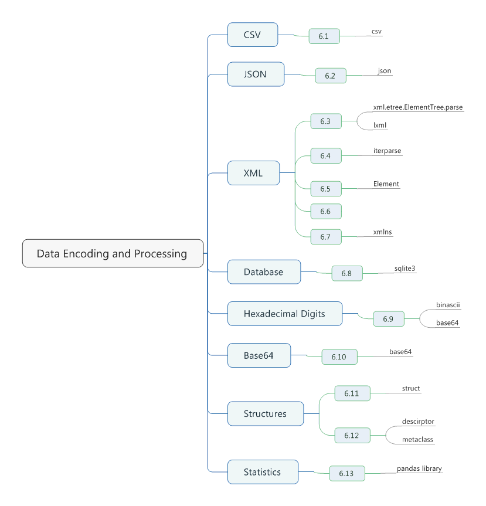

# Chapter 06. Data Encoding and Processing



## 6.1 Reading and Writing CSV file

- For most kinds of CSV data, use the *csv* library.
```python
import csv
with open('stocks.csv') as f:
    f_csv = csv.reader(f)
    headings = next(f_csv)
    print(headings)
    for row in f_csv:
        print(row[0], row[4])

# ['Symbol', 'Price', 'Date', 'Time', 'Change', 'Volume']
# AA -0.18
# AIG -0.15
# AXP -0.46
# BA +0.12
# C -0.25
# CAT -0.23
```

- Since such indexing can often be confusing, this is one place where you might want to consider the use of named tuples.
- This would allow you to use the column headers such as *row.Symbol* and *row.Change* instead of indices.
```python
import csv
from collections import namedtuple

with open('stocks.csv') as f:
    f_csv = csv.reader(f)
    headings = next(f_csv)
    print(headings)
    Row = namedtuple('Row', headings)
    for r in f_csv:
        row = Row(*r)
        print(row.Symbol, row.Change)

# ['Symbol', 'Price', 'Date', 'Time', 'Change', 'Volume']
# AA -0.18
# AIG -0.15
# AXP -0.46
# BA +0.12
# C -0.25
# CAT -0.23
```

- Another alternative is to read the data as a sequence of dictionaries instead.
```python
import csv

with open('stocks.csv') as f:
    f_csv = csv.DictReader(f)
    for row in f_csv:
        print(row['Symbol'], row['Change'])

# AA -0.18
# AIG -0.15
# AXP -0.46
# BA +0.12
# C -0.25
# CAT -0.23
```

- To write CSV data, you also use the *csv* module but create a writer object.
```python
import csv

headers = ['Symbol', 'Price', 'Date', 'Time', 'Change', 'Volume']
rows = [('AA', 39.48, '6/11/2007', '9:36am', -0.18, 181800),
        ('AIG', 71., '6/11/2007', '9:36am', -0.15, 195500),
        ('AXP', 62.58, '6/11/2007', '9:36am', -0.46, 935000),
        ('BA', 98.31, '6/11/2007', '9:36am', +0.12, 104800),
        ('C', 53.08, '6/11/2007', '9:36am', -0.25, 360900),
        ('CAT', 78.29, '6/11/2007', '9:36am', -0.23, 225400)
]

with open('stocks.csv', 'w', newline = '') as f:
    f_csv = csv.writer(f)
    f_csv.writerow(headers)
    f_csv.writerows(rows)
```

- If you have the data as a sequence of dictionaries.
```python
import csv

headers = ['Symbol', 'Price', 'Date', 'Time', 'Change', 'Volume']
rows = [{'Symbol': 'AA',  'Price': 39.48, 'Date': '6/11/2007', 'Time': '9:36am', 'Change': -0.18, 'Volume': 181800},
        {'Symbol': 'AIG', 'Price': 71.38, 'Date': '6/11/2007', 'Time': '9:36am', 'Change': -0.15, 'Volume': 195500},
        {'Symbol': 'AXP', 'Price': 62.58, 'Date': '6/11/2007', 'Time': '9:36am', 'Change': -0.46, 'Volume': 935000},
        {'Symbol': 'BA',  'Price': 98.31, 'Date': '6/11/2007', 'Time': '9:36am', 'Change': +0.12, 'Volume': 104800},
        {'Symbol': 'C',   'Price': 53.08, 'Date': '6/11/2007', 'Time': '9:36am', 'Change': -0.25, 'Volume': 360900},
        {'Symbol': 'CAT', 'Price': 78.29, 'Date': '6/11/2007', 'Time': '9:36am', 'Change': -0.23, 'Volume': 225400}
]

with open('stocks.csv', 'w', newline = '') as f:
    f_csv = csv.DictWriter(f, headers)
    f_csv.writeheader()
    f_csv.writerows(rows)
```

- If you want to read tab-delimited data instead, you could feed *reader()* with *delimiter = '\t'*.
- *csv* does not try to interpret the data or convert it to a type other than a string. If such conversions are important, that is something you'll need to do yourself.
```python
import csv
col_types = [str, float, str, str, float, int]
with open('stocks.csv') as f:
    f_csv = csv.reader(f)
    headers = next(f_csv)
    for row in f_csv:
        row = tuple(convert(value) for convert, value in zip(col_types, row))
        print(row)

# ('AA', 39.48, '6/11/2007', '9:36am', -0.18, 181800)
# ('AIG', 71.38, '6/11/2007', '9:36am', -0.15, 195500)
# ('AXP', 62.58, '6/11/2007', '9:36am', -0.46, 935000)
# ('BA', 98.31, '6/11/2007', '9:36am', 0.12, 104800)
# ('C', 53.08, '6/11/2007', '9:36am', -0.25, 360900)
# ('CAT', 78.29, '6/11/2007', '9:36am', -0.23, 225400)
```

## 6.2 Reading and Writing JSON Data

- The *json* module provides an easy way to encode the decode data in JSON.
- The two main functions are *json.dumps()* and *json.loads()* which is used by strings.
- If you are working with files instead of strings, you can alternatively use *json.dump()* and *json.load()* to encode and decode JSON data.
```python
import json

data = {
    'name'  : 'ACME',
    'shares': 100,
    'price' : 542.23
}

with open('data.json', 'w') as f:
    json.dump(data, f)

with open('data.json', 'r') as f:
    data = json.load(f)
```

- JSON encoding supports the basic types of *None*, *bool*, *int*, *float*, and *str*, as well as lists, tuple, and dictionaries containing those type.
```python
>>> import json
>>> json.dumps(False)
'false'
>>> d = {'a': True, 'b': 'Hello', 'c': None}
>>> json.dumps(d)
'{"a": true, "b": "Hello", "c": null}'
```

- If you want to create different kinds of objects, supply the *object_pairs_hook* or *object_hook* to *json.loads*.
```python
import json
from collections import OrderedDict
s = '{"name": "ACME", "shares": 100, "price": 542.23}'
# preserving JSON data order in an OrderedDict
data = json.loads(s, object_pairs_hook = OrderedDict)
print(data) # OrderedDict([('name', 'ACME'), ('shares', 100), ('price', 542.23)])

class JSONObject:
    def __init__(self, d):
        self.__dict__ = d
# turn a JSON dictionary to a Python object
data = json.loads(s, object_hook = JSONObject)
print(data.name) 
print(data.shares)
print(data.price)

# ACME
# 100
# 542.23
```

- If you would like to output to be nicely formatted, you can use the *indent* argument to *json.dumps()*. This cause the output to be pretty printed in a format similar to that wiht the *pprint()* function.
- If you want the keys to be sorted on output, used the *sort_keys* argument.
- 
```python
>>> import json
>>> data = {"shares": 100, "price": 542.23, "name": "ACME"}
>>> print(json.dumps(data, indent = 4))
{
    "shares": 100,
    "name": "ACME",
    "price": 542.23
}
>>> print(json.dumps(data, sort_keys = True))
{"name": "ACME", "price": 542.23, "shares": 100}
```

- If you want to serialize intances, you can supply a function that takes an instance as input and returns a dictionary that can be serialized.
```python
import json

class Point:
    def __init__(self, x, y):
        self.x = x
        self.y = y

def serialize_instance(obj):
    d = {'__classname__': type(obj).__name__}
    d.update(vars(obj))
    return d

classes = {
    'Point': Point
}

def unserialize_object(d):
    clsname = d.pop('__classname__', None)
    if clsname:
        cls = classes[clsname]
        obj = cls.__new__(cls)
        for key, value in d.items():
            setattr(obj, key, value)
        return obj
    else:
        return d

p = Point(2, 3)
s = json.dumps(p, default = serialize_instance)
a = json.loads(s, object_hook = unserialize_object)
print(s)
print(a)
print(vars(a))

# {"__classname__": "Point", "x": 2, "y": 3}
# <__main__.Point object at 0x0045F5B0>
# {'x': 2, 'y': 3}
```

## 6.3 Parsing Simple XML Data

- The *xml.etree.ElementTree* module can be used to extract data from simple XML documents.
```python
from urllib.request import urlopen
from xml.etree.ElementTree import parse

u = urlopen('http://planet.python.org/rss20.xml')
doc = parse(u)

for item in doc.iterfind('channel/item'):
    title = item.findtext('title')
    date = item.findtext('pubDate')
    link = item.findtext('link')

    print(title)
    print(date)
    print(link)
    print()

# Brett Cannon: Why I took October off from OSS volunteering
# Sun, 04 Dec 2016 11:56:09 +0000
# http://www.snarky.ca/why-i-took-october-off-from-oss-volunteering

# Brett Cannon: What to look for in a new TV
# Sun, 04 Dec 2016 11:56:09 +0000
# http://www.snarky.ca/what-to-look-for-in-a-new-tv

# ... ...
```

- Each element represented by the *ElementTree* module has a few essential attributes and methods that are useful when parsing.
 + The *tag* attribute contains the name of tag.
 + The *text* attribute contains enclosed text.
 + The *get()* method can be used to extract attributes (if any).

## 6.4 Parsing Huge XML Files Incrementally

- Any time you are faced with the problem of incremental data processing, you should think of iterators and generators.
```python
from xml.etree.ElementTree import iterparse

def parse_and_remove(filename, path):
    path_parts = path.split('/')
    doc = iterparse(filename, ('start', 'end'))
    next(doc)

    tag_stack = []
    elem_stack = []
    for event, elem in doc:
        if event == 'start':
            tag_stack.append(elem.tag)
            elem_stack.append(elem)
        elif event == 'end':
            if tag_stack == path_parts:
                yield elem
                elem_stack[-2].remove(elem)
            try:
                tag_stack.pop()
                elem_stack.pop()
            except IndexError:
                pass

from collections import Counter
test_case = Counter()
data = parse_and_remove('testResult.xml', 'TestPackage/TestSuite/TestSuite/TestSuite/TestCase/Test')
print(data)
for d in data:
    test_case[d.get('result')] += 1

for testcase, num in test_case.most_common():
    print(testcase, num)

# <generator object parse_and_remove at 0x0057AD80>
# pass 31665
# fail 64
```

- The iterator created by *iterparse()* produces tuples of the form *(event, elem)*, where *event* is one of the listed events and *elem* is the resulting XML element.
```python
>>> data = iterparse('testResult.xml', ('start', 'end'))
>>> next(data)
('start', <Element 'TestResult' at 0x025A20C0>)
>>> next(data)
('start', <Element 'DeviceInfo' at 0x025A8150>)
>>> next(data)
('start', <Element 'Screen' at 0x025A81B0>)
>>> next(data)
('end', <Element 'Screen' at 0x025A81B0>)
>>> next(data)
('start', <Element 'PhoneSubInfo' at 0x025A81E0>)
>>> next(data)
('end', <Element 'PhoneSubInfo' at 0x025A81E0>)
```

## 6.5 Turning a Dictionary into XML

- Although the *xml.ElementTree* library is commonly used for parsing, it can also be used to create XML documents.
- For I/O, it is easy to convert this to a byte string using the *tostring()* fucntion in *xml.etree.ElementTree*.
- If you want to attach attributes to an element, use its *set()* method.
```python
from xml.etree.ElementTree import Element, tostring

def dict_to_xml(tag, d):
    '''
    Turn a simple dict fo key/value pairs into XML
    '''
    elem = Element(tag)
    for key, val in d.items():
        child = Element(key)
        child.text = str(val)
        elem.append(child)
    return elem

s = {'name': 'Demon', 'shares': '100', 'price': 490.1}
e = dict_to_xml('stock', s)
e.set('_id', '1234')
print(tostring(e))
# b'<stock _id="1234"><name>Demon</name><shares>100</shares><price>490.1</price></stock>'
```

## 6.6 Parsing, Modifying, and Rewriting XML

- The *xml.etree.ElementTree* module makes it easy to perform such tasks.
- Contents of origin *pred.xml* file
```xml
<?xml version="1.0"?>
<stop>
    <id>14791</id>
    <nm>Clark &amp; Balmoral</nm>
    <sri>
        <rt>22</rt>
        <d>North Bound</d>
        <dd>North Bound</dd>
    </sri>
    <cr>22</cr>
    <pre>
        <pt>5 MIN</pt>
        <fd>Howard</fd>
        <v>1378</v>
        <rn>22</rn>
    </pre>
    <pre>
        <pt>15 MIN</pt>
        <fd>Howard</fd>
        <v>1867</v>
        <rn>22</rn>
    </pre>
</stop>
```

- demo
```python
from xml.etree.ElementTree import parse, Element
doc = parse('pred.xml')
root = doc.getroot()
print(root) # <Element 'stop' at 0x00716E40>

root.remove(root.find('sri'))
root.remove(root.find('cr'))

print(root.getchildren().index(root.find('nm'))) # 1
e = Element('spam')
e.text = 'This is a test'
root.insert(2, e)

doc.write('newpred.xml', xml_declaration = True)
```

- Contents of *newpred.xml* file
```xml
<?xml version='1.0' encoding='us-ascii'?>
<stop>
    <id>14791</id>
    <nm>Clark &amp; Balmoral</nm>
    <spam>This is a test</spam><pre>
        <pt>5 MIN</pt>
        <fd>Howard</fd>
        <v>1378</v>
        <rn>22</rn>
    </pre>
    <pre>
        <pt>15 MIN</pt>
        <fd>Howard</fd>
        <v>1867</v>
        <rn>22</rn>
    </pre>
</stop>
```

- You must remember that all modifications are generally made to the parent element, treating it as if it were a list.
- Elements can also be manipulated using indexing and slicing operations, such as *element[i]* or *element[i:j]*.

## 6.7 Parsing XML Documents with Namespaces

- Consider a document that uses namespaces like this:
```xml
<?xml version="1.0" encoding="utf-8"?>
<top>
    <author>David Beazley</author>
    <content>
        <html xmlns="http://www.w3.org/1999/xhtml">
            <head>
                <title>Hello World</title>
            </head>
            <body>
                <h1>Hello World!</h1>
            </body>
        </html>
    </content>
</top>
```

- If you parse this document and try to perform the usual queries, you'll find that it doesn't work so easily because everything becomes incredibly verbos.
```python
>>> doc.findtext('author')
'David Beazley'
>>> doc.find('content')
<Element 'content' at 0x02308180>
>>> doc.find('content/html')
>>> doc.find('content/{http://www.w3.org/1999/xhtml}html')
<Element '{http://www.w3.org/1999/xhtml}html' at 0x023081E0>
>>> doc.findtext('content/{http://www.w3.org/1999/xhtml}html/head/title')
>>> doc.findtext('content/{http://www.w3.org/1999/xhtml}html/{http://www.w3.org/1999/xhtml}head/{http://www.w3.org/1999/xhtml}title')
'Hello World'
```

- You can often simplify matters for yourself by wrapping namespace handling up into a utility class.
```python
from xml.etree.ElementTree import parse, Element
doc = parse('namespaces.xml')

class XMLNamespaces:
    def __init__(self, **kwargs):
        self.namespaces = {}
        for name, uri in kwargs.items():
            self.register(name, uri)
    def register(self, name, uri):
        self.namespaces[name] = '{' + uri + '}'
    def __call__(self, path):
        return path.format_map(self.namespaces)

# ================ RESTART: F:\Learning\Python\Cookbook\test.py ================
# >>> ns = XMLNamespaces(html = 'http://www.w3.org/1999/xhtml')
# >>> doc. find(ns('content/{html}html'))
# <Element '{http://www.w3.org/1999/xhtml}html' at 0x02308270>
# >>> doc.findtext(ns('content/{html}html/{html}head/{html}title'))
# 'Hello World'      
```

- If the text you are parsing makes use of namespaces in addition to other advanced XML features, you're really better off using the *lxml library* instead of ElementTree.

## 6.8 Interacting with a Relational Database

- To illustrate, you can use the *sqlite3* module that comes with Python.
- The first step is to connect to the database. Typically, you execute a *connect()* funcion, supplying parameters such as the name of the database, hostname, password, and other details as needed.
- To do anything with the data, you next create a cursor.
```python
stocks = [
    ('GOOG', 100, 490.1),
    ('AAPL', 50, 545.75),
    ('FB', 150, 7.45),
    ('HPQ', 75, 33.2),
]

import sqlite3
db = sqlite3.connect('database.db')

c = db.cursor()
c.execute('create table portfolio (symbol text, shares integar, price real)')
db.commit()

c.executemany('insert into portfolio values (?,?,?)', stocks)
db.commit()

for row in db.execute('select * from portfolio'):
    print(row)

# ('GOOG', 100, 490.1)
# ('AAPL', 50, 545.75)
# ('FB', 150, 7.45)
# ('HPQ', 75, 33.2)

min_price = 100
for row in db.execute('select * from portfolio where price >= ?', (min_price, )):
    print(row)

# ('GOOG', 100, 490.1)
# ('AAPL', 50, 545.75)
```

## 6.9 Decoding and Encoding Hexadecimal Digits

- If you simply need to decode or encode a raw string of hex digits, use the *binascii* module.
```python
>>> s = b'hello'
>>> import binascii
>>> h = binascii.b2a_hex(s)
>>> h
b'68656c6c6f'
>>> binascii.a2b_hex(h)
b'hello'
```

- Similar functionality can also be found in the *base64* module.
```python
>>> import base64
>>> h = base64.b16encode(s)
>>> h
b'68656C6C6F'
>>> base64.b16decode(h)
b'hello'
```

- It's also important to note that the output produced by the encoding functions is always a byte string. To coerce it to Unicode for output, you may need to add an extra decoding step.
```python
>>> print(h.decode('ascii'))
68656C6C6F
```

## 6.10 Decoding and Encoding Base64

- The *base64* moduel has two functions -- *b64encode()* and *b64decode()* -- that do exactly what you want.
```python
>>> s = b'hello'
>>> import base64
>>> a = base64.b64encode(s)
>>> a
b'aGVsbG8='
>>> base64.b64decode(a)
b'hello'
>>> base64.b64encode(s).decode('ascii')
'aGVsbG8='
```

## 6.11 Reading and Writing Binary Arrays of Structures

- To work with binary data, use the *struct* module.
- Here is an example of code that writes a list of Python tuples out a binary file.
```python
from struct import Struct

def write_records(records, format, f):
    '''
    Write a sequence of tuples to a binary file of structures.
    '''
    record_struct = Struct(format)
    for r in records:
        f.write(record_struct.pack(*r))

def read_records(format, f):
    record_struct = Struct(format)
    chunks = iter(lambda: f.read(record_struct.size), b'')
    return (record_struct.unpack(chunk) for chunk in chunks)

if __name__ == '__main__':
    records = [(1, 2.3, 4.5),
               (6, 7.8, 9.0),
               (12, 13.4, 56.7)]
    with open('data.b', 'wb') as f:
        write_records(records, '<idd', f)
    with open('data.b', 'rb') as f:
        for rec in read_records('<idd', f):
            print(rec)

# (1, 2.3, 4.5)
# (6, 7.8, 9.0)
# (12, 13.4, 56.7)
```

- If you want to read the file entirely into a byte string with a single read and convert it piece by piece.
```python
def unpack_records(format, data):
    record_struct = Struct(format)
    return (record_struct.unpack_from(data, offset)
            for offset in range(0, len(data), record_struct.size))

if __name__ == '__main__':
    with open('data.b', 'rb') as f:
        data = f.read()
        for rec in unpack_records('<idd', data):
            print(rec)

# (1, 2.3, 4.5)
# (6, 7.8, 9.0)
# (12, 13.4, 56.7)
```

- Stuctures are always defined using a set of structure codes such as *i, d, f*, and so forth. These codes **correspond to** specific binary data types such as 32-bit(4-byte) intergers, 64-bit(8-byte) floats, 32-bit(4-byte) floats, and so forth.
- The < in the first character specifies the byte ordering. In this example, it is indicating "little endian". Change the character to > for big endian or ! for network byte order.
```python
>>> from struct import Struct
>>> record_struct = Struct('<idd')
>>> record_struct.size
20
```

- In the *read_records()* function, *iter()* is being used to make an iterator that returns fixed_sized *chunks*. This iterator repeatedly calls a user-supplied callable until it returns a specified value, at wihch point iteration stops.
- In the *unpack_records()* function, *unpack_from()* method is used. You just give it a byte string(or any array) along with a byte offset, and it will unpack fields directly from that location.

## 6.12 Reading Nested and Variable-Sized Binary Structures

- You need to read complicated binary-encoded data that contains a collection of nested and/or variable-sized records.
- Suppose you have this Python data structure representing a collection of points that make up a series of polygons:
```python
polys = [
         [ (1.0, 2.5), (3.5, 4.0), (2.5, 1.5) ],
         [ (7.0, 1.2), (5.1, 3.0), (0.5, 7.5), (0.8, 9.0) ],
         [ (3.4, 6.3), (1.2, 0.5), (4.6, 9.2) ],
]
```

- Now suppose this data was to be encoded into a binary file where the file started with the following header.
| Byte | Type | Description |
| ---- | ---- | ----------- |
| 0    | int    | File code (0x1234, little endian)  |
| 4    | double | Minimum x (little endian) |
| 12   | double | Minimum y (little endian) |
| 20   | double | Maximum x (little endian) |
| 28   | double | Maximum y (little endian) |
| 36   | int    | Number of polygons (little endian) |
- Following the header, a series of polygon records follow, each encoded as follows:
| Byte | Type | Description |
| ---- | ---- | ----------- |
| 0 |int |Record length including length (N bytes) |
| 4-N |Points |Pairs of (X,Y) coords as doubles |

- To write this file, you can use Python code like this:
```python
import struct
import itertools

def write_ploys(filename, polys):
    flattened = list(itertools.chain(*polys))
    min_x = min(x for x, y in flattened)
    max_x = max(x for x, y in flattened)
    min_y = min(y for x, y in flattened)
    max_y = max(y for x, y in flattened)

    with open(filename, 'wb') as f:
        f.write(struct.pack('<iddddi', 0x1234, min_x, min_y, max_x, max_y, len(polys)))
        for poly in polys:
            size = len(poly) * struct.calcsize('<dd')
            f.write(struct.pack('<i', size + 4))
            for pt in poly:
                f.write(struct.pack('<dd', *pt))

write_ploys('polys.bin', polys)
```

- To read the resulting data back, you can write very similar looking code using the *struct.unpack()* function, reversing the operations performed during writing.
```python
import struct
def read_polys(filename):
    with open(filename, 'rb') as f:
        # Read the header
        header = f.read(40)
        file_code, min_x, min_y, max_x, max_y, num_polys = \
        struct.unpack('<iddddi', header)
        polys = []
        for n in range(num_polys):
            pbytes, = struct.unpack('<i', f.read(4))
        poly = []
        for m in range(pbytes // 16):
            pt = struct.unpack('<dd', f.read(16))
            poly.append(pt)
        polys.append(poly)
return polys
```

- Another way to represent such information is through the use of a class.
- The *Structure* class just serves as a base class that accepts some byte data and stores it as the underlying memory buffer used by the *StructField* descriptor.
```python
import struct
import itertools

class StructField:
    '''
    Descriptor representing a simple structure field
    '''
    def __init__(self, format, offset):
        self.format = format
        self.offset = offset
    def __get__(self, instance, offset):
        if instance is None:
            return self
        else:
            r = struct.unpack_from(self.format, instance._buffer, self.offset)
            return r[0] if len(r) == 1 else r

class Structure:
    def __init__(self, bytedata):
        self._buffer = memoryview(bytedata)

class PolyHeader(Structure):
    file_code = StructField('<i', 0)
    min_x = StructField('<d', 4)
    min_y = StructField('<d', 12)
    max_x = StructField('<d', 20)
    max_y = StructField('<d', 28)
    num_polys = StructField('<i', 36)
```
```python
# test
>>> f = open('polys.bin', 'rb')
>>> phead = PolyHeader(f.read(40))
>>> phead.file_code == 0x1234
True
>>> phead.min_x
0.5
>>> phead.min_y
0.5
>>> phead.max_x
7.0
>>> phead.max_y
9.2
>>> phead.num_polys
3
```

- Any time you are faced with class definitions that are overly verbose like this, you might consider the use of a class decorator or metaclass.
```python
import struct
import itertools

class StructField:
    '''
    Descriptor representing a simple structure field
    '''
    def __init__(self, format, offset):
        self.format = format
        self.offset = offset
    def __get__(self, instance, offset):
        if instance is None:
            return self
        else:
            r = struct.unpack_from(self.format, instance._buffer, self.offset)
            return r[0] if len(r) == 1 else r

class StructureMeta(type):
    '''
    Metaclass that automatically creates StructField descriptor
    '''
    def __init__(self, clsname, bases, clsdict):
        fields = getattr(self, '_fields_', [])
        byte_order = ''
        offset = 0
        for format, fieldname in fields:
            if format.startswith(('<', '>', '!', '@')):
                byte_order = format[0]
                format = format[1:]
            format = byte_order + format
            setattr(self, fieldname, StructField(format, offset))
            offset += struct.calcsize(format)
        setattr(self, 'struct_size', offset)

class Structure(metaclass = StructureMeta):
    def __init__(self, bytedata):
        self._buffer = bytedata

    @classmethod
    def from_file(cls, f):
        return cls(f.read(cls.struct_size))

class PolyHeader(Structure):
    _fields_ = [
       ('<i', 'file_code'),
       ('d', 'min_x'),
       ('d', 'min_y'),
       ('d', 'max_x'),
       ('d', 'max_y'),
       ('i', 'num_polys')]
```
```python
# test
>>> f = open('polys.bin', 'rb')
>>> phead = PolyHeader.from_file(f)
>>> phead.file_code == 0x1234
True
>>> phead.min_x
0.5
>>> phead.min_y
0.5
>>> phead.max_x
7.0
>>> phead.max_y
9.2
>>> phead.num_polys
3
```

- Once you introduce a metaclass into the mix, you can build more intelligence into it.
- In this code, the *NestedStruct* descriptor is used to overlay another structure definition over a region of memory. It does this by taking a slice of the original memory buffer and using it to instantiate the given stucture type.
```python
import struct
import itertools

class StructField:
    '''
    Descriptor representing a simple structure field
    '''
    def __init__(self, format, offset):
        self.format = format
        self.offset = offset
    def __get__(self, instance, offset):
        if instance is None:
            return self
        else:
            r = struct.unpack_from(self.format, instance._buffer, self.offset)
            return r[0] if len(r) == 1 else r

class NestedStruct:
    '''
    Descriptor representing a nested structure
    '''
    def __init__(self, name, struct_type, offset):
        self.name = name
        self.struct_type = struct_type
        self.offset = offset
    def __get__(self, instance, cls):
        if instance is None:
            return self
        else:
            data = instance._buffer[self.offset:
                               self.offset + self.struct_type.struct_size]
            result = self.struct_type(data)
            # Save resulting structure back on instance to avoid further recomputation of this step
            setattr(instance, self.name, result)
            return result

class StructureMeta(type):
    '''
    Metaclass that automatically creates StructField descriptor
    '''
    def __init__(self, clsname, bases, clsdict):
        fields = getattr(self, '_fields_', [])
        byte_order = ''
        offset = 0
        for format, fieldname in fields:
            if isinstance(format, StructureMeta):
                setattr(self, fieldname, NestedStruct(fieldname, format, offset))
                offset += format.struct_size
            else:
                if format.startswith(('<', '>', '!', '@')):
                    byte_order = format[0]
                    format = format[1:]
                format = byte_order + format
                setattr(self, fieldname, StructField(format, offset))
                offset += struct.calcsize(format)
        setattr(self, 'struct_size', offset)

class Structure(metaclass = StructureMeta):
    def __init__(self, bytedata):
        self._buffer = bytedata

    @classmethod
    def from_file(cls, f):
        return cls(f.read(cls.struct_size))

class Point(Structure):
    _fields_ = [
          ('<d', 'x'),
          ('d', 'y')
    ]

class PolyHeader(Structure):
    _fields_ = [
           ('<i', 'file_code'),
           (Point, 'min'),
           (Point, 'max'),
           ('i', 'num_polys')
    ]
```
```python
# test
>>> f = open('polys.bin', 'rb')
>>> phead = PolyHeader.from_file(f)
>>> phead.file_code == 0x1234
True
>>> phead.min
<__main__.Point object at 0x0229FD90>
>>> phead.min.x
0.5
>>> phead.min.y
0.5
>>> phead.max.x
7.0
>>> phead.max.y
9.2
>>> phead.num_polys
3
```

- If the remainder of the polygon files contain sections fo variable size.
- One way to handle this is to write a class that simply represents a chunk of binary data along with a utility function for interpreting the contents in different ways.
```python
class SizedRecord:
    def __init__(self, bytedata):
        self._buffer = memoryview(bytedata)

    @classmethod
    def from_file(cls, f, size_fmt, includes_size = True):
        sz_nbytes = struct.calcsize(size_fmt)
        sz_bytes = f.read(sz_nbytes)
        sz, = struct.unpack(size_fmt, sz_bytes)
        buf = f.read(sz - includes_size * sz_nbytes)
        return cls(buf)

    def iter_as(self, code):
        if isinstance(code, str):
            s = struct.Struct(code)
            for off in range(0, len(self._buffer), s.size):
                yield s.unpack_from(self._buffer, off)
        elif isinstance(code, StructureMeta):
            size = code.struct_size
            for off in range(0, len(self._buffer), size):
                data = self._buffer[off:off + size]
                yield code(data)
```
```python
# test
>>> f = open('polys.bin', 'rb')
>>> phead = PolyHeader.from_file(f)
>>> phead.num_polys
3
>>> polydata = [SizedRecord.from_file(f, '<i') for n in range(phead.num_polys)]
>>> polydata
[<__main__.SizedRecord object at 0x02318150>, <__main__.SizedRecord object at 0x02318110>, <__main__.SizedRecord object at 0x02318490>]
>>> for n, poly in enumerate(polydata):
    print('Polygon', n)
    for p in poly.iter_as('<dd'):
        print(p)

        
Polygon 0
(1.0, 2.5)
(3.5, 4.0)
(2.5, 1.5)
Polygon 1
(7.0, 1.2)
(5.1, 3.0)
(0.5, 7.5)
(0.8, 9.0)
Polygon 2
(3.4, 6.3)
(1.2, 0.5)
(4.6, 9.2)
>>> for  n, poly in enumerate(polydata):
    print('Polygon', n)
    for p in poly.iter_as(Point):
        print(p.x, p.y)

        
Polygon 0
1.0 2.5
3.5 4.0
2.5 1.5
Polygon 1
7.0 1.2
5.1 3.0
0.5 7.5
0.8 9.0
Polygon 2
3.4 6.3
1.2 0.5
4.6 9.2
```

- Putting all of this together, here's an alternative formulation of the *read_polys* function.
```python
def read_polys(filename):
    polys = []
    with open(filename, 'rb') as f:
        phead = PolyHeader.from_file(f)
        for n in range(phead.num_polys):
            rec = SizedRecord.from_file(f, '<i')
            poly = [(p.x, p.y) for p in rec.iter_as(Point)]
            polys. append(poly)
    return polys
```

## 6.13 Summarizing Data and Preforming Statistics

- For any kind of data analysis involving statistics, time series, and other related techniques, you should look at the *Pandas library*.
```python
>>> datas = pandas.read_csv('stocks.csv', skip_footer = 1)
>>> datas
  Symbol  Price       Date    Time  Change  Volume
0     AA  39.48  6/11/2007  9:36am   -0.18  181800
1    AIG  71.38  6/11/2007  9:36am   -0.15  195500
2    AXP  62.58  6/11/2007  9:36am   -0.46  935000
3     BA  98.31  6/11/2007  9:36am    0.12  104800
4      C  53.08  6/11/2007  9:36am   -0.25  360900
>>> datas['Date'].unique()
array(['6/11/2007'], dtype=object)
```

- Pandas is a large library that has more features than can be described here.
