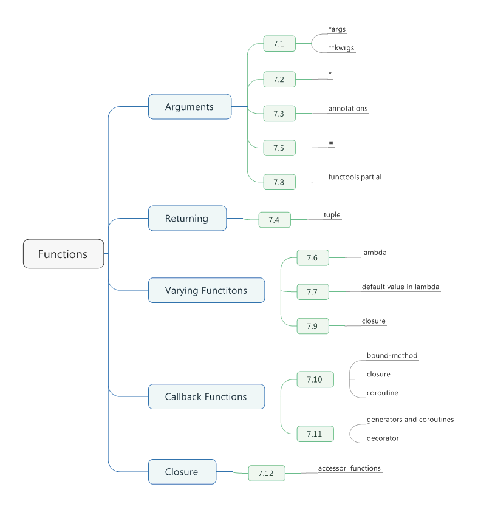

# Chapter 07. Functions



## 7.1 Writing Functions That Accept Any Number of Arguments

- To write a function that accepts any number of positional arguments, use a * argument.
```python
def avg(first, *rest):
    return (first + sum(rest)) / (1 + len(rest))

print(avg(1, 2))       # 1.5
print(avg(1, 2, 3, 4)) # 2.5
```

- To accept any number of keyword arguments, use an argument that starts with **.
- *attr* is a dictionary that holds the passed keyword arguments (if any).
```python
import html
def make_element(name, value, **attrs):
    keyvals = [' %s = "%s"' % item for item in attrs.items()]
    attr_str = ''.join(keyvals)
    element = '<{name}{attrs}>{value}</{name}>'.format(
        name = name,
        attrs = attr_str,
        value = html.escape(value))
    return element

print(make_element('item', 'ALbatross', size = 'large', quantite = 6))
print(make_element('p', '<spam>'))

# <item quantite = "6" size = "large">ALbatross</item>
# <p>&lt;spam&gt;</p>
```

- A * argument can only appear as the last positional argument in a function definition.
- A ** argument can only appear as the last argument.

## 7.2 Writing Functions That Only Accept Keyword Arguments

- This feature is easy to implement if you place the keyword arguments after a * argument or a single unnamed *.
```python
def recv(maxsize, *, block):
    'Receives a message'
    pass

recv(1024, True)
# TypeError: recv() takes 1 positional argument but 2 were given
recv(1024, block = True)
```

- This technique can also be used to specify keyword arguments for functions that accept a varying number of positional arguments.
```python
def minimum(*value, clip = None):
    m = min(value)
    if clip is not None:
        m = clip if clip > m else m
    return m

print(minimum(1, 5, 2, -5, 10))           # -5
print(minimum(1, 5, 2, -5, 10, clip = 0)) # 0
```

## 7.3 Attaching Informational Metadata to Function Arguments

- Function argument **annotations** can be a useful way to give programmers hints about how a fucntion is supposed to be used.
- Although you can attach kind of object to a function as an annotation, classes or strings often seem to make the most sense.
- Function annotations are merely stored in a function's `__annotations__` attribute.
```python
def add(x:int, y:int) -> int:
    return x + y

print(help(add))

# Help on function add in module __main__:

# add(x:int, y:int) -> int
```

## 7.4 Returning Multiple Values from a Function

- To return multiple values from a function, simply return a tuple.
- It's actually the comma that forms a tuple, not the parentheses.
```python
>>> def myfun():
    return 1, 2, 3

>>> a, b, c = myfun()
>>> a
1
>>> b
2
>>> c
3
```

## 7.5 Defining Functions with Default Arguments

- On the surface, defining a function with optional arguments is easy -- simply assign values in the definition and make sure that default arguments appear last.
- If the default value is supposed to be a mutable container, such as a list, set, or dictionary, use *None* as the default.
- If, instead of providing a default value, you want to write code that merely tests whether an optional argument was given an interesting value or not. You can code it like this.
```python
_no_value = object()

def spam(a, b = _no_value):
    if b is _no_value:
        print('No b value supplied')

spam(1) # No b value supplied
spam(1, None)
```

- Some rules
 1. The values assigned as a default are bound only once at the time of function definition.
 2. The values assigned as defaults should always be immutable objects, such as *None*, *True*, *False*, numbers, or strings.
 3. The use of the *is* operator when testing for None is a critical part of this recipe.

## 7.6 Defining Anonymous or Inline Functions

- Simple functions that do nothing more than evaluate an expression can be replaced by a *lambda* expression.
```python
>>> add = lambda x, y: x + y
>>> add(2, 3)
5
```

- Typically, *lambda* is used in the context of some other operation, such as sorting or data reduction.
```python
names = ['David Beazley', 'Brian Jones', 'Raymond Hettinger', 'Ned Batchelder']
name_sorted = sorted(names, key = lambda name: name.split()[-1].lower())
print(name_sorted)
```

- In particular, only a single expression can be specified, **the result of which is the return value**.

## 7.7 Capturing Variables in Anonymous Functions

- If you want an anonymous function to capture a value at the point of definition and keep it, include the value as a default value.
```python
x = 10
a = lambda y, x = x: x + y
x = 20
b = lambda y, x = x: x + y

print(a(10)) # 20
print(b(10)) # 30
```

- The results have no difference with each other, if you code like this. 
```python
x = 10
a = lambda y: x + y
x = 20
b = lambda y: x + y

print(a(10)) # 30
print(b(10)) # 30
```

- The problem here is that the value of *x* used in the *lambda* expression is a free variable that gets bound at runtime, not defination time.
- Creating a list of *lambda* expressions using a list comprehension or in a loop of some kind and expecting the lambda functions to remember the iteration variable at the time of definition.
```python
funcs = [lambda x: x + n for n in range(5)]
for f in funcs:
    print(f(0))
# 4
# 4
# 4
# 4
# 4

funcs = [lambda x, n = n: x + n for n in range(5)]
for f in funcs:
    print(f(0))
# 0
# 1
# 2
# 3
# 4
```


## 7.8 Making an N-Argument Callable Work As a Callable with Fewer Arguments

- If you need to reduce the number of arguments to a function, you should use *functools.partial()*.
- The *partial()* function allows you to assign fixed values to one or more of the arguments, thus reducing the number of arguments that need to be supplied to subsequent calls.
- *partial()* fixes the values for certain arguments and returns a new callable as a result.
```python
```

- Suppose you have a list of points represented as tuples of (x, y) coodinates, you could using the following function to compute the distance between two points.
```python
points = [(1, 2), (3, 4), (5, 6), (7, 8)]

import math
def distance(p1, p2):
    x1, y1 = p1
    x2, y2 = p2
    return math.hypot(x2 - x1, y2 - y1)
```

- Now suppose you want ot sort all of the points according to their distance from some other point.
```python
from functools import partial
pt = (4, 3)
points.sort(key = partial(distance, pt))
print(points) # [(3, 4), (1, 2), (5, 6), (7, 8)]
```

- *partial()* can often be used to tweak the argument signatures of callback functions used in other libraries.
```python
def spam(a, b, c, d):
    print(a, b, c, d)

from functools import partial
s1 = partial(spam, 1)
s1(2, 3, 4)
s1(3, 5, 6)

# 1 2 3 4
# 1 3 5 6
```

## 7.9 Replacing Single Method Classes with Functions

- In many cases, single-method classes can be turned into functions using closures.
```python
from urllib.request import urlopen

class UrlTemplate:
    def __init__(self, template):
        self.template = template
    def open(self, **kwargs):
        return urlopen(self.template.format_map(kwargs))

yahoo = UrlTemplate('http://finance.yahoo.com/d/quotes.csv?s={names}&f={fields}')
for line in yahoo.open(names = 'IBM, AAPL, FB', fields = 'sl1c1v'):
    print(line.decode('utf-8'))

# "IBM",165.36,+0.57,3266436

# "AAPL",112.12,+1.09,0

# "FB",118.91,+0.96,0
```
```python
from urllib.request import urlopen

def urltemplate(template):
    def opener(**kwargs):
        return urlopen(template.format_map(kwargs))
    return opener

yahoo = urltemplate('http://finance.yahoo.com/d/quotes.csv?s={names}&f={fields}')
for line in yahoo(names = 'IBM, AAPL, FB', fields = 'sl1c1v'):
    print(line.decode('utf-8'))

# "IBM",165.36,+0.57,3266436

# "AAPL",112.12,+1.09,0

# "FB",118.91,+0.96,0
```

## 7.10 Carrying Extra State with Callback Functions

- One way to carry extra information in a callback is to use a bound-method instead of a simple function.
```python
def apply_async(func, args, *, callback):
    result = func(*args)
    callback(result)

def add(x, y):
    return x + y

class ResultHandler:
    def __init__(self):
        self.sequence = 0
    def handler(self, result):
        self.sequence += 1
        print('[{}] Got: {}'.format(self.sequence, result))

r = ResultHandler()
apply_async(add, (2, 3), callback = r.handler)
apply_async(add, ('hello', 'demon'), callback = r.handler)

# [1] Got: 5
# [2] Got: hellodemon
```

- As and alternative to a class, you can also use a closure to capture state.
```python
def apply_async(func, args, *, callback):
    result = func(*args)
    callback(result)

def add(x, y):
    return x + y

def make_handler():
    sequence = 0
    def handler(result):
        nonlocal sequence
        sequence += 1
        print('[{}] Got: {}'.format(sequence, result))
    return handler

handler = make_handler()
apply_async(add, (2, 3), callback = handler)
apply_async(add, ('hello', 'demon'), callback = handler)

# [1] Got: 5
# [2] Got: hellodemon
```

- As yet another variation on this theme, you can sometimes use a **coroutine** to accomplish the same thing.
```python
def apply_async(func, args, *, callback):
    result = func(*args)
    callback(result)

def add(x, y):
    return x + y

def make_handler():
    sequence = 0
    while True:
        result = yield
        sequence += 1
        print('[{}] Got: {}'.format(sequence, result))

handler = make_handler()
next(handler)

apply_async(add, (2, 3), callback = handler.send)
apply_async(add, ('hello', 'demon'), callback = handler.send)

# [1] Got: 5
# [2] Got: hellodemon
```

- You can also carry state into a callback using an extra argument and partial function application.

## 7.11 Inlining Callback Functions

- Callback functions can be inlined into a function using generators and coroutines.
```python
def apply_async(func, args, *, callback):
    result = func(*args)
    callback(result)

from queue import Queue
from functools import wraps

class Async:
    def __init__(self, func, args):
        self.func = func
        self.args = args

def inlined_async(func):
    @wraps(func)
    def wrapper(*args):
        f = func(*args)
        result_queue = Queue()
        result_queue.put(None)
        while True:
            result = result_queue.get()
            try:
                a = f.send(result)
                apply_async(a.func, a.args, callback = result_queue.put)
            except StopIteration:
                break
    return wrapper

def add(x, y):
    return x + y

@inlined_async
def test():
    r = yield Async(add, (2, 3))
    print(r)
    r = yield Async(add, ('hello', 'world'))
    print(r)
    for n in range(10):
        r = yield Async(add, (n, n))
        print(r)
    print('Goodbye')


test()

# 5
# helloworld
# 0
# 2
# 4
# 6
# 8
# 10
# 12
# 14
# 16
# 18
# Goodbye
```

- The *yield* operation makes a generator function emit a value and suspend. Subsequent calls to the `__next__()` or *send()* method of a generator will make it start again.
- The core of this recipe is found in the *inline_async()* decorator function. The key idea is that the decorator will step the generator function through all of its *yield* statements, one at a time.

## 7.12 Accessing Variables Defined Inside a Closure

- Normally, the inner variable of a closure are completely hidden to the outside world. However, you can provide access by writing accessor functions and attaching them to the closure as function attributes.
```python
def sample():
    n = 0
    # Closure function
    def func():
        print('n =', n)

    # Accessor methods for n
    def get_n():
        return n

    def set_n(value):
        nonlocal n
        n = value

    # Attach as function attributes
    func.get_n = get_n
    func.set_n = set_n

    return func

f = sample()
f()
f.set_n(10)
f()
print(f.get_n())

# n = 0
# n = 10
# 10
```
