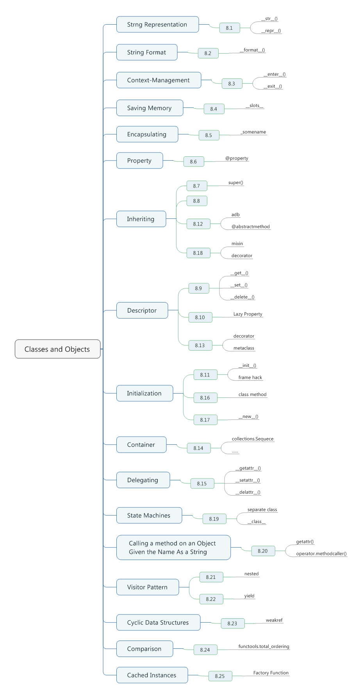

# Chapter 08. Classes and Objects



## 8.1 Changing the String Representation of Instances

- To change the string representation of instance, define the `__str__()` and `__repr__()` methods.
- The `__repr__()` method returns the code representation of an instance, and is usually the text you would type to recreate the instance. The built-in *repr()* function returns this text, as does interactive interpreter when inspecting values.
- The `__str__()` method converts the instance to a string, and is the output produced by the *str()* and *print()* functions.
- The format code *{0.x}* specifies the *x-attribute* of argument 0.
```python
class Pair:
    def __init__(self, x, y):
        self.x = x
        self.y = y
    def __repr__(self):
        return 'Pair({0.x!r}, {0.y!r})'.format(self)
    def __str__(self):
        return '({0.x!r}, {0.y!r})'.format(self)
# >>> p = Pair(3, 4)
# >>> p
# Pair(3, 4) # __repr__() output
# >>> print(p)
# (3, 4) # __str__() output
```

- Specifically, the special *!r* formatting code indicates that the output of `__repr_()` should be used instead of `__str__()`, the default.
```python
>>> print('p is {0!r}'.format(p))
p is Pair(3, 4)
>>> print('p is {0}'.format(p))
p is (3, 4)
```

- It is standard practice for the output of `__repr__()` to produce text such that `eval(repr(x)) == x`.

## 7.2 Customizing String Formatting

- To customize string formatting, define the `__format__()` method on a class.
```python
_formats = {
    'ymd' : '{d.year}-{d.month}-{d.day}',
    'mdy' : '{d.month}/{d.day}/{d.year}',
    'dmy' : '{d.day}/{d.month}/{d.year}'
}

class Date:
    def __init__(self, year, month, day):
        self.year = year
        self.month = month
        self.day = day

    def __format__(self, code):
        if code == '':
            code = 'ymd'
        fmt = _formats[code]
        return fmt.format(d = self)

d = Date(2016, 12, 12)
print(format(d))
print(format(d, 'mdy'))
print('The date is {:ymd}'.format(d))
print('The date is {:dmy}'.format(d))

# 2016-12-12
# 12/12/2016
# The date is 2016-12-12
# The date is 12/12/2016
```

## 8.3 Making Objects Support the Context-Management Protocol

- Make your objects support the context-management protocol(the *with* statement)
- In order to make an object compatible with the *with* statement, you need to implement `__enter__()` and `__exit__()` method.
```python
from socket import socket, AF_INET, SOCK_STREAM

class LazyConnection:
    def __init__(self, address, family = AF_INET, type = SOCK_STREAM):
        self.address = address
        self.family = AF_INET
        self.type = SOCK_STREAM
        self.sock = None

    def __enter__(self):
        if self.sock is not None:
            raise RuntimeError('Already connected')
        self.sock = socket(self.family, self.type)
        self.sock.connect(self.address)
        return self.sock

    def __exit__(self, exc_ty, exc_val, tb):
        self.sock.close()
        self.sock = None
```

- When the *with* statement is first encountered, the `__enter__()` method is triggered.
- The return value of `__enter__()` is placed into the variable indicated with *as* qualifier.
- The `__exit__()` method is triggered to clean up.
- Context managers are most commonly used in programs that need to manage resources such as files, network connections, and locks.

## 8.4 Saving Memory When Creating a Large Number of Instances

- For classes that primarily serve as simple data structures, you can often greatly reduce the memory footprint of instances by add `__slots__` attribute to class definition.
- When you define `__slots__`, Python uses a much more compact internal representation for instances. Instead of each instance consist of a dictionary, instances are built around a small fixed-sized array, much like a tuple or list.
- Attribute names listed inth `__slots__` specifier are internally mapped to specific indices wihtin this array.
- A side effect of using slots is that it is no longer possible to add new attributes to instances -- you are restricted to only those attribute name s listed in the `__slots__` specifier.
- For the most part, you should only use slots on classes that are going to serve as frequently used data structures in your program.
```python
class Date:
    __slots__ = ['year', 'month', 'day']
    def __init__(self, year, month, day):
        self.year = year
        self.month = month
        self.day = day
```

## 8.5 Encapsulating Names in a Class

- The first convention is that any name that starts with a single leading underscore(_) should always be assumed to be internal implementation.
```python
class A:
    def __init__(self):
        self._internal = 0
        self.public = 1

    def public_method(self):
        '''
        A public method
        '''
        pass

    def _internal_method(self):
        pass
```

- You may also encounter the use of two leading underscores(__) on names within class definitions.
- The use of double leading underscores causes the name to be mangled to something else.
- The purpose of name mangling is inheritance -- such attributes cannot be overridden via inheritance.
```python
class B:
    def __init__(self):
        self.__private = 0
    def __private_method(self):
        pass
    def public_method(self):
        self.__private_method()
```

## 8.6 Creating Managed Attributes

- A simple way to customize access to an attirbute is to define it as a "property".
- In the following code,
 1. The first method is a getter function, and establishes *first_name* as being a property.
 2. The two methods attach optional setter and deleter functions to *first_name* property.
 3. It's important to stress that the *@first_name.setter* and *@first_name.deleter* decorators won't be defined unless *first_name* was already established as a property using *@property*.
 4. A critical feature of a property is that it looks like a normal attribute, but access automatically triggers the getter, setter, and deleter methods.
 5. Don't write properties that don't actually add anything extra like this.
```python
class Person:
    def __init__(self, first_name):
        self.first_name = first_name

    @property
    def first_name(self):
        return self._first_name

    @first_name.setter
    def first_name(self, value):
        if not isinstance(value, str):
            raise TypeError('Expected a string')
        self._first_name = value

    @first_name.deleter
    def first_name(self):
        raise AttributeError("Can't delete attribute")

# >>> a = Person('Demon')
# >>> a.first_name
# 'Demon'
# >>> a.first_name = 42
# Traceback (most recent call last):
#   File "<pyshell#2>", line 1, in <module>
#     a.first_name = 42
#   File "F:\Learning\Python\Cookbook\test.py", line 12, in first_name
#     raise TypeError('Expected a string')
# TypeError: Expected a string
# >>> del a.first_name
# Traceback (most recent call last):
#   File "<pyshell#3>", line 1, in <module>
#     del a.first_name
#   File "F:\Learning\Python\Cookbook\test.py", line 17, in first_name
#     raise AttributeError("Can't delete attribute")
# AttributeError: Can't delete attribute
```

- Properties can also be defined for existing get and set methods.
```python
class Person:
    def __init__(self, first_name):
        self.set_first_name(first_name)

    def get_first_name(self):
        return self._first_name

    def set_first_name(self, value):
        if not isinstance(self, str):
            raise TypeError('Expected a string')
        self._first_name = value

    def del_first_name(self):
        raise AttributeError("Can't delete attribute")

    name = property(get_first_name, set_first_name, del_first_name)
```

- Properties can also be a way to define computed attributes. These are attributes that are not actually stored, but computed on demand.
```python
import math
class Circle:
    def __init__(self, radius):
        self.radius = radius
    @property
    def area(self):
        return math.pi * self.radius ** 2
    @property
    def perimeter(self):
        return 2 * math.pi * self.radius

# >>> c = Circle(4.0)
# >>> c.radius
# 4.0
# >>> c.area
# 50.26548245743669
# >>> c.perimeter
# 25.132741228718345
```

## 8.7 Calling a Method on a Parent Class

- To call a method in a parent(or superclass), use the *super()* function.
- A very common use of *super()* is in the handling of the `__init__()` method to make sure that parents are properly initialized.
- Another common use of *super()* is in code that overrides any of Python's special methods.
```python
class Proxy:
    def __init__(self, obj):
        self._obj = obj

    def __getattr__(self, name):
        return getattr(self._obj. name)

    def __setattr__(self, name, value):
        if name.startswith('-'):
            super().__setattr__(name, value)
        else:
            setattr(self._obj, name, value)

```

- For every class that you define, Python computes what's known as a method resolution order (MRO) list.
```python
class Base:
    def __init__(self):
        print('Base.__init__')

class A(Base):
    def __init__(self):
        super().__init__()
        print('A.__init__')

class B(Base):
    def __init__(self):
        super().__init__()
        print('B.__init__')

class C(A, B):
    def __init__(self):
        super().__init__()
        print('C.__init__')

# >>> c = C()
# Base.__init__
# B.__init__
# A.__init__
# C.__init__
# >>> C.__mro__
# (<class '__main__.C'>, <class '__main__.A'>, <class '__main__.B'>, <class '__main__.Base'>, <class 'object'>)
```

- The actual determination of MRO list itself is made using a technique known as C3 Linearization. It's actually a merge sort of the MROs from the parent classes subject to there constraints:
 1. Child classes get checked before parent
 2. Multiple parents get checked in the order listed.
 3. If there are two valid choices for the next class, pick the one from the first parent.
- When you use the *super()* function, Python continues its search starting with the next class on the MRO.
- *super()* works even though there is no explicit base class listed.
```python
class A:
    def spam(self):
        print('A.spam')
        super().spam()

class B:
    def spam(self):
        print('B.spam')

class C(A, B):
    pass

c = C()
c.spam()

# A.spam
# B.spam
```

- Here you see that the use of *super().spam()* in class A has, in fact, called the *spam()* method in class B. This is all explained by the MRO of class C.
- Using *super()* in this manner is most common when defining mixin class.

## 8.8 Extending a Property in a Subclass

- Within a subclass, you want to extend the functionality of a property defined in a parent class.
```python
class Person:
    def __init__(self, name):
        self.name = name

    @property
    def name(self):
        return self._name

    @name.setter
    def name(self, value):
        if not isinstance(value, str):
            raise TypeError('Expected a string')
        self._name = value

    @name.deleter
    def name(self):
        raise AttributeError("Can't delete attribute")

class SubPerson(Person):
    @property
    def name(self):
        print('Getting name')
        return super().name

    @name.setter
    def name(self, value):
        print('Setting name to', value)
        super(SubPerson, SubPerson).name.__set__(self, value)

    @name.deleter
    def name(self):
        print('Deleting name')
        super(SubPerson, SubPerson).name.__delete__(self)

# >>> s = SubPerson('Demon')
# Setting name to Demon
# >>> s.name
# Getting name
# 'Demon'
# >>> s. name = 'Wisdom'
# Setting name to Wisdom
# >>> s.name = 42
# Setting name to 42
# Traceback (most recent call last):
#   File "<pyshell#3>", line 1, in <module>
#     s.name = 42
#   File "F:\Learning\Python\Cookbook\test.py", line 28, in name
#     super(SubPerson, SubPerson).name.__set__(self, value)
#   File "F:\Learning\Python\Cookbook\test.py", line 12, in name
#     raise TypeError('Expected a string')
# TypeError: Expected a string
```

- If you only want to extend one of the methods of a property.
```python
class SubPerson(Person):
    @Person.name.getter
    def name(self):
        print('Getting name')
        return super().name
```

- If you only want to redefine one of the methods, it's not enough to use *@property* by iteself.

## 8.9 Creating a New Kind of Class or Instance Attribute

- If you want to create an entirely new kind of instance attribute, define its functionality in the form of a descriptor class.
- A decriptor is a class that implements the three core attribute access operations(get, set, and delete) in the form of `__get__()`, `__set__()`, and `__delete__()` special methods.
- This methods work by receiving an instance as input.
- The underlying dictionary of the instance is then manipulated as appropriate.
```python
class Integer:
    def __init__(self, name):
        self.name = name

    def __get__(self, instance, cls):
        if instance is None:
            return self
        else:
            return instance.__dict__[self.name]

    def __set__(self, instance, value):
        if not isinstance(value, int):
            raise TypeError('Expected an int')
        instance.__dict__[self.name] = value

    def __delete__(self, instance):
        del instance.__dict__[self.name]
```

- To use a descriptor, instances of the descriptor are placed into a class definiton as class variables.
```python
class Point:
    x = Integer('x')
    y = Integer('y')
    def __init__(self, x, y):
        self.x = x
        self.y = y
```

- When you do this, all access to the descriptor attributes is captured by the `__get__()`, `__set__()`, and `__delete__()` method.
```python
p = Point(2, 3)
print(p.x) # Call Point.x.__get__(p, Point)
print(p.y) # Call Point.y.__get__(p, Point)
p.y = 5    # Call Point.y.__set__(p, Point)

p.x = 2.3  # Call Point.x.__set__(p, Point)
# Traceback (most recent call last):
#   File "F:\Learning\Python\Cookbook\test.py", line 30, in <module>
#     p.x = 2.3
#   File "F:\Learning\Python\Cookbook\test.py", line 13, in __set__
#     raise TypeError('Expected an int')
# TypeError: Expected an int
```

- One confusion with descriptors is that they can only be defined at the class level, not on a per-instance basis. Thus, code like this will not work:
```python
class Point:
    def __init__(self, x, y):
         self.x = Instance('x')
         self.y = Instance('y') # No! Must be a class variable
```

- The reason `__get__()` looks somewhat complicated is to account for the distinction between instance variable and class variables.
 + If a descriptor is accessed as a class variable, the **instance** argument is set to None.
```python
p.x # Calls Point.x.__get__(p, Point)
Point.x # Calls Point.x.__get__(None, Point)
```

## 8.10 Using Lazily Computed Properties

- You'd like to define a read-only attribute as a property that only gets computed on access. However, once accessed, you'd like the value to be catched and not recomputed on each access.
- An efficient way to define a lazy attribute is through the use of a descriptor class, such as the following.
```python
class lazyproperty:
    def __init__(self, func):
        self.func = func

    def __get__(self, instance, cls):
        if instance is None:
            return self
        else:
            value = self.func(instance)
            setattr(instance, self.func.__name__, value)
            return value
```

- To utilize this code, you would use it in a class as the following.
```python
import math

class Circle:
    def __init__(self, radius):
        self.radius = radius

    @lazyproperty
    def area(self):
        print('Computing Area')
        return math.pi * self.radius ** 2

    @lazyproperty
    def perimeter(self):
        print('Computing Perimeter')
        return 2 * math.pi * self.radius

# >>> c = Circle(4.0)
# >>> c.radius
# 4.0
# >>> c.area
# Computing Area
# 50.26548245743669
# >>> c.area
# 50.26548245743669
# >>> c.perimeter
# Computing Perimeter
# 25.132741228718345
# >>> c.perimeter
# 25.132741228718345
```

- The `__get__()` method only fires if the attribute being accessed is not in the underlying instance dictionary.
```python
>>> c = Circle(4.0)
>>> vars(c)
{'radius': 4.0}
>>> c.area
Computing Area
50.26548245743669
>>> vars(c)
{'area': 50.26548245743669, 'radius': 4.0}
>>> c.perimeter
Computing Perimeter
25.132741228718345
>>> vars(c)
{'area': 50.26548245743669, 'radius': 4.0, 'perimeter': 25.132741228718345}
```

- One possible downside is that the computed value becomes mutable after it's created. If that's a concern, you can use a slightly less efficient implementation. 
```python
def lazyproperty(func):
    name = '_lazy_' + func.__name__
    @property
    def lazy(self):
        if hasattr(self, name):
            return getattr(self, name)
        else:
            value = func(self)
            setattr(self, name, value)
            return value
    return lazy
```

## 8.11 Simplifying the Initialization of Data Structures

- You can often generalize the initialization of data structures into a single `__init__()` function defined in a common base class.
```python
class Structure:
    _fields = []
    def __init__(self, *args, **kwargs):
        if len(args) > len(self. _fields):
            raise TypeError('Expected {} arguments'.format(len(self._fields)))

        for name, value in zip(self._fields, args):
            setattr(self, name, value)

        for name in self._fields[len(args):]:
            setattr(self, name, kwargs.pop(name))

        if kwargs:
            raise TypeError('Invalid argument(s): {}'.format(','.join(kwargs)))

import math

if __name__ == '__main__':
    class Stock(Structure):
        _fields = ['name', 'shares', 'price']

    class Point(Structure):
        _fields = ['x', 'y']

    class Circle(Structure):
        _fields = ['radius']
        def area(self):
            return math.pi * self.radius ** 2

    s = Stock('ACME', 50, 91.1)
    p = Point(2, 3)
    c = Circle(4.5)
    s1 = Stock('ACME', 50, price = 91.1)
```

- One subtle aspect of the implementation concerns the mechanism used to set value using the *setattr()* function. Instead of doing that, you might be inclined to directly access the instance dictionary.
- It's often not safe to make assumptions about the implementation of a subclass. If a subclass decided to use `__slot__` or wrap a specific property (or decriptor), directly accessing the instance dictionary would break.
```python
class Structure:
    _fields = []
    def __init__(self, *args):
        if len(args) != len(self. _fields):
            raise TypeError('Expected {} arguments'.format(len(self._fields)))

        self.__dict__.update(zip(self._fields, args))
```

- It should be noted that it is also possible to automatically initialize instance variables using a utility function and a so-called "frame hack".
```python
def init_fromlocals(self):
    import sys
    locs = sys._getframe(1).f_locals
    for k, v in locs.items():
        if k != 'self':
            setattr(self, k, v)

class Stock:
    def __init__(self, name, shares, price):
        init_fromlocal(self)
```

## 8.12 Defining an Interface or Abstract Base Class

- To define an abstract base class, use the *abc* module.
- A central feature of an abstract base class is that it cannot be instantiated directly.
- An abstract base class is meant to be used as a base class for other classes that are expected to implement the required methods.
```python
from abc import ABCMeta, abstractmethod

class IStream(metaclass = ABCMeta):
    @abstractmethod
    def read(self, maxbytes = -1):
        pass
    @abstractmethod
    def write(self, data):
        pass

class SocketStream(IStream):
    def read(self, maxbytes = -1):
        ...
    def write(self, data):
        ...
```

- A major use fo abstract base classes is in code that wants to enforce an expected programming interface.
- *ABCs* allow other classes to be registered as implementing the required interface.
```python
import io
IStream.register(io.IOBase)
f = open('somefile.txt')
print(isinstance(f, IStream)) # True
```

- It should be noted that *@abstractmethod* can also be applied to static methods, class methods, and properties. You just need to make sure you apply it in the proper sequence where *@abstractmethod* appears immediately before the function definition.

## 8.13 Implementing a Data Model or Type System

- You need to customize the setting of attributes on a per-attribute basis. To do this, you should use descriptors.
- The following code illustrates the use of descriptors to implement a system type and value checking framework.
```python
class Descriptor:
    def __init__(self, name = None, **opts):
        self.name = name
        for key, value in opts.items():
            setattr(self, key, value)

    def __set__(self, instance, value):
        instance.__dict__[self.name] = value

class Typed(Descriptor):
    expected_type = type(None)
    def __set__(self, instance, value):
        if not isinstance(value, self.expected_type):
            raise TypeError('Expected ' + str(self.expected_type))
        super().__set__(instance, value)

class Unsigned(Descriptor):
    def __set__(self, instance, value):
        if value < 0:
            raise ValueError('Expected >= 0')
        super().__set__(instance, value)

class MaxSized(Descriptor):
    def __init__(self, name = None, **opts):
        if 'size' not in opts:
            raise TypeError('Missing size option')
        super().__init__(name, **opts)

    def __set__(self, instance, value):
        if len(value) >= self.size:
            raise ValueError('Size must be < ' + str(self.size))
        super().__set__(instance, value)
```

- These classes should be viewed as basic building blocks from which you construct a data model or type system.
- Continuing, here is some code that implements some different kinds of data.
```python
class Integer(Typed):
    expected_type = int

class UnsignedInteger(Integer, Unsigned):
    pass

class Float(Typed):
    expected_type = float

class UnsignedFloat(Float, Unsigned):
    pass

class String(Typed):
    expected_type = str

class SizedString(String, MaxSized):
    pass
```

- Using these type objects, it is now possible to define a class.
```python
class Stock:
    name = SizedString('name', size = 8)
    shares = UnsignedInteger('shares')
    price = UnsignedFloat('price')
    def __init__(self, name, shares, price):
        self.name = name
        self.shares = shares
        self.price = price
        
# >>> s = Stock('ACME', 50, 91.1)
# >>> s.name
# 'ACME'
# >>> s.shares = 70
# >>> s.shares = -10
# Traceback (most recent call last):
#   File "<pyshell#3>", line 1, in <module>
#     s.shares = -10
#   File "F:\Learning\Python\Cookbook\test.py", line 15, in __set__
#     super().__set__(instance, value)
#   File "F:\Learning\Python\Cookbook\test.py", line 20, in __set__
#     raise ValueError('Expected >= 0')
# ValueError: Expected >= 0
```

- There are some techniques that can be used to simplify the specification of constraints in classes.
- One approach is to use a class decorator.
```python
def check_attributes(**kwargs):
    def decorate(cls):
        for key, value in kwargs.items():
            if isinstance(value, Descriptor):
                value.name = key
                setattr(cls, key, value)
            else:
                setattr(cls, key, value(key))
        return cls
    return decorate

@check_attributes(name = SizedString(size = 8), shares = UnsignedInteger, price = UnsignedFloat)
class Stock:
    def __init__(self, name, shares, price):
        self.name = name
        self.shares = shares
        self.price = price
```

- Another approach to simplify the specification of constraints is to use a *metaclass*.
```python
class checkedmeta(type):
    def __new__(cls, clsname, bases, methods):
        for key, value in methods.items():
            if isinstance(value, Descriptor):
                value.name = key
        return type.__new__(cls, clsname, bases, methods)

class Stock(metaclass = checkedmeta):
    name = SizedString(size = 8)
    shares = UnsignedInteger()
    price = UnsignedFloat()
    def __init__(self, name, shares, price):
        self.name = name
        self.shares = shares
        self.price = price
```

- As a final twist, a class decorator approach can also be used as a replacement for mixin classes, multiple inheritance, and tricky use of the *super()* function.
```python
class Descriptor:
    def __init__(self, name = None, **opts):
        self.name = name
        for key, value in opts.items():
            setattr(self, key, value)

    def __set__(self, instance, value):
        instance.__dict__[self.name] = value

def Typed(expected_type, cls = None):
    if cls is None:
        return lambda cls: Typed(expected_type, cls)

    super_set = cls.__set__
    def __set__(self, instance, value):
        if not isinstance(value, expected_type):
            raise TypeError('expected ' + str(expected_type))
        super_set(self, instance, value)
    cls.__set__ = __set__
    return cls

def Unsigned(cls):
    super_set = cls.__set__
    def __set__(self, instance, value):
        if value < 0:
            raise ValueError('Expected >= 0')
        super_set(self, instance, value)
    cls.__set__ = __set__
    return cls

def MaxSized(cls):
    super_init = cls.__init__
    def __init__(self, name = None, **opts):
        if 'size' not in opts:
            raise TypeError('Missing size option')
        super_init(self, name, **opts)
    cls.__init__ = __init__

    super_set = cls.__set__
    def __set__(self, instance, value):
        if len(value) >= self.size:
            raise ValueError('size must be < ' + str(self.size))
        super_set(self, instance, value)
    cls.__set__ = __set__
    return cls

@Typed(int)
class Integer(Descriptor):
    pass

@Unsigned
class UnsignedInteger(Integer):
    pass

@Typed(float)
class Float(Descriptor):
    pass

@Unsigned
class UnsignedFloat(Float):
    pass

@Typed(str)
class String(Descriptor):
    pass

@MaxSized
class SizedString(String):
    pass
```

## 8.14 Implementing Custom Container

- The *collections* library defines a variety of abstract base classes that are extremely useful when impelementing custom container classes.
- To illustrate, suppose you want your class to support iteration. To do that, simply start by having it inherit from *collections.Iterable*. And you should ensure that you implement all of hte required special methods(`__iter__()`). If you don't, you'll get an error upon instantiation.
- Simply instantiate any of these class to see what methods need to be implemented to make a custom container with that behavior.
```python
import collections

collections.Sequence()
# Traceback (most recent call last):
#   File "F:\Learning\Python\Cookbook\test.py", line 3, in <module>
#     collections.Sequence()
# TypeError: Can't instantiate abstract class Sequence with abstract methods __getitem__, __len__
```

- Here is a simple example of a class that implements the preceding methods to create a sequence where items are always stored in sorted order.
- As you can see, instances of *SortedItems* behave exactly like a normal sequence and support all of the usual operations, including indexing, iteration, *len()*, containment(the *in* operator), and even slicing.
```python
import collections
import bisect

class SortedItems(collections.Sequence):
    def __init__(self, initial = None):
        self._items = sorted(initial) if initial is not None else []

    def __getitem__(self, index):
        return self._items[index]

    def __len__(self):
        return len(self._items)

    def add(self, item):
        bisect.insort(self._items, item)

items = SortedItems([5, 1, 3])
print(list(items)) # [1, 3, 5]
print(items[0])    # 1
print(items[-1])   # 5
items.add(2)
print(list(items)) # [1, 2, 3, 5]
items.add(-10)
print(list(items)) # [-10, 1, 2, 3, 5]
print(items[1:4])  # [1, 2, 3]
print(3 in items)  # True
print(len(items))  # 5
for n in items:
    print(n)

# -10
# 1
# 2
# 3
# 5
```

- As an aside, the *bisect* module used in this recipe is a convenient way to keep items in a list sorted.
- To illustrate, suppose you have a class that inherits from *collections.MutableSequence*.
```python
import collections

class Item(collections.MutableSequence):
    def __init__(self, initial = None):
        self._items = list(initial) if initial is not None else []

    def __getitem__(self, index):
        print('Getting', index)
        return self._items[index]

    def __setitem__(sel, index, value):
        print('Setting', index, value)
        self._items[index] = value

    def __delitem__(self, index):
        print('Deleting', index)
        del self._items[index]

    def insert(self, index, value):
        print('Inserting', index, value)
        self._items.insert(index, value)

    def __len__(self):
        print('Len')
        return len(self._items)

# >>> a = Item([1, 2 ,3])
# >>> len(a)
# Len
# 3
# >>> a.append(4)
# Len
# Inserting 3 4
# >>> a.append(2)
# Len
# Inserting 4 2
# >>> a.count(2)
# Getting 0
# Getting 1
# Getting 2
# Getting 3
# Getting 4
# Getting 5
# 2
# >>> a.remove(3)
# Getting 0
# Getting 1
# Getting 2
# Deleting 2
# >>>
```

## 8.15 Delegating Attribute Access

- Delegation is a programming pattern where the reponsibility for implementing a particular operation is handed off to a different object.
```python
class Proxy:
    def __init__(self, obj):
        self._obj = obj

    def __getattr__(self, name):
        print('getattr:', name)
        return getattr(self._obj, name)

    def __setattr__(self, name, value):
        if name.startswith('_'):
            super().__setattr__(name, value)
        else:
            print('setattr', name, value)
            setattr(self._obj, name, value)

    def __delattr__(self, name):
        if name.startswith('_'):
            super().__delattr__(name)
        else:
            print('delattr', name)
            delattr(self._obj, name)

class Spam:
    def __init__(self, x):
        self.x = x
    def bar(self, y):
        print('Spam.bar:', self.x, y)

s = Spam(2)
p = Proxy(s)

print(p.x)
p.bar(3)
p.x = 37

# getattr: x
# 2
# getattr: bar
# Spam.bar: 2 3
# setattr x 37
```

- When using delegation to implement proxies, there are a few additional details to note.
 1. The `__getattr__()` method is kind of like a catch-all for attribute lookup. It's a method that gets called if code tries to access an attribute that doesn't exist.
 2. The `__getattr__()` method is actually a fallback method that only gets called when an attribute is not found. Thus, when attributes of the proxy  instance itself are accessed, this method would not be triggered.
 3. The `__setattr__()` and `__delattr__()` methods need a bit of extra logic added to separate attributes from the proxy instance itself and attributes on the internal object `_obj`.
 4. A common convention is for proxies to only delegate to attributes that don't startwith a leading undercore.
 5. It is also important to emphasize that `__getattr__()` method usually does not apply to most special methods that start and end double underscores.
 
## 8.16 Defining More Than One Constructor in a Class

- To define a class with more than one constructor, you should use a class method.
```python
import time

class Date:
    def __init__(self, year, month, day):
        self.year = year
        self.month = month
        self.day = day

    @classmethod
    def today(cls):
        t = time.localtime()
        return cls(t.tm_year, t.tm_mon, t.tm_mday)

a = Date(2016, 12, 14)
b = Date.today()
```

- A critical feature of a class method is that it receives the class as the first argument(*cls*). You will notice that this class is used within the method to create and return the final instance.
- It is extremely subtle, but this aspect of class methods makes them work correctly with features such as inheritance.

## 8.17 Creating an Instance Without Invoking *init*

- A bare uninitialized instance can be created by directly calling the `__new__()` method of a class.
```python
import time

class Date:
    def __init__(self, year, month, day):
        self.year = year
        self.month = month
        self.day = day

d = Date.__new__(Date)
data = {'year': 2016, 'month': 12, 'day': 14}
for key, value in data.items():
    setattr(d, key, value)

print(d.year)   # 2015
print(d.month)  # 12
print(d.day)    # 14
```

## 8.18 Extending Classes with Mixins

- Suppose you have an interest in adding various customizations to mapping objects.
```python
class LoggedMappingMixin:
    '''
    Add logging to get/set/delete operations for debugging.
    '''
    __slots__ = ()

    def __getitem__(self, key):
        print('Getting ' + str(key))
        return super().__getitem__(key)

    def __setitem__(self, key, value):
        print('Setting {} = {!r}'.format(key, value))
        return super().__setitem__(key, value)

    def __delitem__(self, key):
        print('Deleting ' + str(key))
        return super().__delitem__(key)

class SetOnceMappingMinxin:
    '''
    Only allow a key to be set once.
    '''
    __slots__ = ()
    def __setitem__(self, key, value):
        if key in self:
            raise KeyError(str(key) + ' already set')
        return super().__setitem__(key, value)

class StringKeysMappingMixin:
    '''
    Restrict keys to strings only
    '''
    __slots__ = ()
    def __setitem__(self, key, value):
        if not isinstance(key, str):
            raise TypeError('keys must be string')
        return super().__setitem__(key, value)
class LoggedMappingMixin:
    '''
    Add logging to get/set/delete operations for debugging.
    '''
    __slots__ = ()

    def __getitem__(self, key):
        print('Getting ' + str(key))
        return super().__getitem__(key)

    def __setitem__(self, key, value):
        print('Setting {} = {!r}'.format(key, value))
        return super().__setitem__(key, value)

    def __delitem__(self, key):
        print('Deleting ' + str(key))
        return super().__delitem__(key)

class SetOnceMappingMinxin:
    '''
    Only allow a key to be set once.
    '''
    __slots__ = ()
    def __setitem__(self, key, value):
        if key in self:
            raise KeyError(str(key) + ' already set')
        return super().__setitem__(key, value)

class StringKeysMappingMixin:
    '''
    Restrict keys to strings only
    '''
    __slots__ = ()
    def __setitem__(self, key, value):
        if not isinstance(key, str):
            raise TypeError('keys must be string')
        return super().__setitem__(key, value)
```

- These classes, by themselves, are useless. Instead, they are supposed to be mixed with other mapping classes through multiple inheritance.
- When combined, the classes all work together to provide the desired functionality.
```python
class LoggedDict(LoggedMappingMixin, dict):
    pass

d = LoggedDict()
d['x'] = 23 # Setting x = 23
d['x']      # Getting x
del d['x']  # Deleting x

from collections import defaultdict
class SetOnceDefaultDict(SetOnceMappingMinxin, defaultdict):
    pass

d = SetOnceDefaultDict(list)
d['x'].append(2)
d['y'].append(3)
d['x'].append(10)
# d['x'] = 23
# Traceback (most recent call last):
#   File "F:\Learning\Python\Cookbook\test.py", line 55, in <module>
#     d['x'] = 23
#   File "F:\Learning\Python\Cookbook\test.py", line 26, in __setitem__
#     raise KeyError(str(key) + ' already set')
# KeyError: 'x already set'

from collections import OrderedDict
class StringOrderedDict(StringKeysMappingMixin, SetOnceMappingMinxin, OrderedDict):
    pass

d = StringOrderedDict()
d['x'] = 23
# d[42] = 10
# Traceback (most recent call last):
#   File "F:\Learning\Python\Cookbook\test.py", line 69, in <module>
#     d[42] = 10
#   File "F:\Learning\Python\Cookbook\test.py", line 36, in __setitem__
#     raise TypeError('keys must be string')
# TypeError: keys must be string

# # d['x'] = 42
# Traceback (most recent call last):
#   File "F:\Learning\Python\Cookbook\test.py", line 76, in <module>
#     d['x'] = 42
#   File "F:\Learning\Python\Cookbook\test.py", line 37, in __setitem__
#     return super().__setitem__(key, value)
#   File "F:\Learning\Python\Cookbook\test.py", line 26, in __setitem__
#     raise KeyError(str(key) + ' already set')
# KeyError: 'x already set'
```

- There are a few important implementation details to keep in mind.
 1. Mixin classes are never meant to be instantiated directly. They have to be mixed with another class that implements the required mapping functionality.
 2. Mixin classes typically have no state of their own. This means there is no `__init__()` method and no instance variable.
 3. Use of the *super()* function is an essential and critical part of writing mixin classes. Using *super()* delegates to the next class on the method resolution order(MRO). For example, the use of *super()* in *LoggedMappingMixin* delegates to the next class over in the multiple inheritance list.
- An alternative implementation of mixins involves the use of class decorators.
```python
def LoggedMapping(cls):
    cls_getitem = cls.__getitem__
    cls_setitem = cls.__setitem__
    cls_delitem = cls.__delitem__

    def __getitem__(self, key):
        print('Getting' + str(key))
        return cls_getitem(self, key)

    def __setitem__(self, key, value):
        print('Seting {} = {!r}'.format(key, value))
        return cls_setitem(self, key, value)

    def __delitem__(self, key):
        print('Deleting ' + str(key))
        return cls_delitem(self, key)

    cls.__getitem__ = __getitem__
    cls.__setitem__ = __setitem__
    cls.__delitem__ = __delitem__
    return cls

@LoggedMapping
class LoggedDict(dict):
    pass
```

## 8.19 Implementing Stateful Objects or State Machines

- In certain applications, you might have objects that operate differently according to some kind of internal state. Consider a simple class presenting a connection.
```python
class Connection:
    def __init__(self):
        self.state = 'CLOSED'

    def read(self):
        if self.state != 'OPEN':
            raise RuntimeError('Not open')
        print('reading')

    def write(self, data):
        if self.state != 'OPEN':
            raise RuntimeError('Not open')
        print('writing')

    def open(self):
        if self.state == 'OPEN':
            raise RuntimeError('Already open')
        self.state = 'OPEN'

    def close(self):
        if self.state == 'CLOSED':
            raise RuntimeError('Already closed')
        self.state = 'CLOSED'
```

- A more elegant approach is to encode each operational state as a separate class and arrange for the *Connection* class to delegate to the state class.
```python
class Connection:
    def __init__(self):
        self.new_state(ClosedConnectionState)

    def new_state(self, newstate):
        self._state = newstate

    def read(self):
        return self._state.read(self)

    def write(self, data):
        return self._state.write(self, data)

    def open(self):
        return self._state.open(self)

    def close(self):
        return self._state.close(self)

class ConnectionState:
    @staticmethod
    def read(conn):
        raise NotImplementedError()

    @staticmethod
    def write(conn, data):
        raise NotImplementedError()

    @staticmethod
    def open(conn):
        raise NotImplementedError()

    @staticmethod
    def close(conn):
        raise NotImplementedError()

class ClosedConnectionState(ConnectionState):
    @staticmethod
    def read(conn):
        raise RuntimeError('Not open')

    @staticmethod
    def write(conn, data):
        raise RuntimeError('Not open')

    @staticmethod
    def open(conn):
        conn.new_state(OpenConnectionState)

    @staticmethod
    def close(conn):
        raise RuntimeError('Already closed')

class OpenConnectionState(ConnectionState):
    @staticmethod
    def read(conn):
        print('reading')

    @staticmethod
    def write(conn, data):
        print('writing')

    @staticmethod
    def open(conn):
        raise RuntimeError('Already open')

    @staticmethod
    def close(conn):
        conn.new_state(ClosedConnectionState)

# >>> c = Connection()
# >>> c._state
# <class '__main__.ClosedConnectionState'>
# >>> c.read()
# Traceback (most recent call last):
#   File "<pyshell#2>", line 1, in <module>
#     c.read()
#   File "F:\Learning\Python\Cookbook\test.py", line 9, in read
#     return self._state.read(self)
#   File "F:\Learning\Python\Cookbook\test.py", line 40, in read
#     raise RuntimeError('Not open')
# RuntimeError: Not open
# >>> c.open()
# >>> c._state
# <class '__main__.OpenConnectionState'>
# >>> c.read()
# reading
# >>> c.write('hello')
# writing
# >>> c.close()
# >>> c._state
# <class '__main__.ClosedConnectionState'>
# >>>
```

- This design is based on a decision to not store any instance data in the different state classes themeselves. Instead, all instance data should be stored on the *Connection* instance.
- An alternative implementation techique concerns direct manipulation of the `__class__` attribute of instance.
```python
class Connection:
    def __init__(self):
        self.new_state(ClosedConnection)

    def new_state(self, newstate):
        self.__class__ = newstate

    def read(self):
        raise NotImplementedError()

    def write(self, data):
        raise NotImplementedError()

    def open(self):
        raise NotImplementedError()

    def close(self):
        raise NotImplementedError()

class OpenConnection(Connection):
    def read(self):
        print('reading')

    def write(self, data):
        print('writing')

    def open(self):
        raise RuntimeError('Already open')

    def close(self):
        self.new_state(ClosedConnection)

class ClosedConnection(Connection):
    def read(self):
        raise RuntimeError('Not open')

    def write(self, data):
        raise RuntimeError('Not open')

    def open(self):
        self.new_state(OpenConnection)

    def close(self):
        raise RuntimeError('Already closed')
```

- Objected-oriented might be offended by the idea of simply changing the instance `__class__` attribute.
- However, it's technically allowed. Also, it might result in slightly faster code since all of the methods on the connection no longer involve an extra delegation step.

## 8.20 Calling a Method on an Object Given the Name As a String

- For simple cases, you might use *getattr()*.
```python
import math

class Point:
    def __init__(self, x, y):
        self.x = x
        self.y = y

    def __repr__(self):
        return 'Point({!r:}, {!r:})'.format(self.x, self.y)

    def distance(self, x, y):
        return math.hypot(self.x - x, self.y - y)

p = Point(3, 4)
d = getattr(p, 'distance')(0, 0)
print(d) # 5.0
```

- An alternatvie approach is to use *operator.methodcaller()*.
```python
import operator
d = operator.methodcaller('distance', 0, 0)(p)
print(d) # 5.0
```

- Calling a method is actually two separate steps involving an attribute lookup and a function call. 
- Therefore, to call a method, you simply look up the attribute using *getattr()*, as for any other attribute. To invoke the result as a method, simply treat the result of the lookup as a function.
- *operator.methodcaller()* creates a callable object, but also fixes any arguments that are going to be supplied to the method.

## 8.21 Implementing the Visitor Pattern

- The problems addressed by this recipe is one that often arises in programs that build data structures consisting of a large number of different kinds of object. To illustrate, suppose you are trying to write a program that represents mathematical expressions.
```python
class Node:
    pass

class UnaryOperator(Node):
    def __init__(self, operand):
        self.operand = operand

class BinaryOperator(Node):
    def __init__(self, left, right):
        self.left = left
        self.right = right

class Add(BinaryOperator):
    pass

class Sub(BinaryOperator):
    pass

class Mul(BinaryOperator):
    pass

class Div(BinaryOperator):
    pass

class Negate(UnaryOperator):
    pass

class Number(Node):
    def __init__(self, value):
        self.value = value

# Representation of 1 + 2 * (3 - 4) / 5
t1 = Sub(Number(3), Number(4))
t2 = Mul(Number(2), t1)
t3 = Div(t2, Number(5))
t4 = Add(Number(1), t3)
```

- To enable general-purpose processing, a common solution is to implement the so-called "visitor pattern" using a class similar to this:
```python
class NodeVisitor:
    def visit(self, node):
        methname = 'visit_' + type(node).__name__
        meth = getattr(self, methname, None)
        if meth is None:
            meth = self.generic_visit
        return meth(node)
    def generic_visit(self, node):
        raise RuntimeError('No {} method'.format('visit_' + type(node).__name__))
```

- To use this class, a programmer inherits from it and implements various methods of the form *visit_Name()*, where Name is substituted with the node type.
```python
class NodeVisitor:
    def visit(self, node):
        methname = 'visit_' + type(node).__name__
        meth = getattr(self, methname, None)
        if meth is None:
            meth = self.generic_visit
        return meth(node)
    def generic_visit(self, node):
        raise RuntimeError('No {} method'.format('visit_' + type(node).__name__))

class Evaluator(NodeVisitor):
    def visit_Number(self, node):
        return node.value

    def visit_Add(self, node):
        return self.visit(node.left) + self.visit(node.right)

    def visit_Sub(self, node):
        return self.visit(node.left) - self.visit(node.right)

    def visit_Mul(self, node):
        return self.visit(node.left) * self.visit(node.right)

    def visit_Div(self, node):
        return self.visit(node.left) / self.visit(node.right)

    def visit_Negate(self, node):
        return - node.operand

e = Evaluator()
print(e.visit(t4)) # 0.6
```

- As a completely different example, here is a class that translates an expression into operations on a simple stack machine.
```python
class StackCode(NodeVisitor):
    def generate_code(self, node):
        self.instructions = []
        self.visit(node)
        return self.instructions

    def visit_Number(self, node):
        self.instructions.append(('PUSH', node.value))

    def binop(self, node, instructions):
        self.visit(node.left)
        self.visit(node.right)
        self.instructions.append((instructions,))

    def visit_Add(self, node):
        self.binop(node, 'ADD')

    def visit_Sub(self, node):
        self.binop(node, 'SUB')

    def visit_Mul(self, node):
        self.binop(node, 'MUL')

    def visit_Div(self, node):
        self.binop(node, 'DIV')

    def unaryop(self, node, instructions):
        self.visit(node.operand)
        self.instructions.append((instructions,))

    def visit_Negate(self, node):
        self.unaryop(node, 'NEG')

s = StackCode()
print(s.generate_code(t4))
# [('PUSH', 1), ('PUSH', 2), ('PUSH', 3), ('PUSH', 4), ('SUB',), ('MUL',), ('PUSH', 5), ('DIV',), ('ADD',)]
```

- There are really two key ideas in this recipe.
 1. The first is a design strategy where code that manipulates a complicated data structure is decoupled from the data itself. None of the various *Node* classes provide any implementation that does anything with the data.
 2. The implementation of the visitor itself.
- One weakness of the visitor pattern is its heavy reliance on recursion. If you try to apply it to a deeply nested structure, it's possible that you will hit Python's recurion depth limit(see *sys.getrecursionlimit()*).

## 8.22 Implementing the Visitor Pattern Without Recursion

- Clever use of generators can sometimes be used to eliminate recursion from algorithms involving tree traversal or searching.
```python
import types

class NodeVisitor:
    def visit(self, node):
        stack = [ node ]
        last_result = None
        while stack:
            try:
                last = stack[-1]
                if isinstance(last, types.GeneratorType):
                    stack.append(last.send(last_result))
                    last_result = None
                elif isinstance(last, Node):
                    stack.append(self._visit(stack.pop()))
                else:
                    last_result = stack.pop()
            except StopIteration:
                stack.pop()
        return last_result

    def _visit(self, node):
        methname = 'visit_' + type(node).__name__
        meth = getattr(self, methname, None)
        if meth is None:
            meth = self.generic_visit
        return meth(node)

    def generic_visit(self, node):
        raise RuntimeError('No {} method.'.format('visit_' + type(node).__name__))
```

- The preceding code works for simple expressions. However, the implementation of *Evaluator* uses recursion and crashes if things get too nested.
- The code works by simply looking at the top the stack and deciding what to do next.
 + If it's a generator, then its *send()* method is invoked with the result (if any) and the result appended onto the stack for further processing. The value returned by *send()* is the same value that was given to the *yield* statement.
 + If the top of the stack is a *Node* instance, then it is replaced by the result of calling the appropriate visit method for that node.
 + If the top of the stack is anything else, it's assumed to be a return value of some kind.
- So we must change the *Evaluator* class ever so slightly tho the following:
```python
class Evaluator(NodeVisitor):
    def visit_Number(self, node):
        return node.value

    def visit_Add(self, node):
        yield (yield node.left) + (yield node.right)

    def visit_Sub(self, node):
        yield (yield node.left) - (yield node.right)

    def visit_Mul(self, node):
        yield (yield node.left) * (yield node.right)

    def visit_Div(self, node):
        yield (yield node.left) / (yield node.right)

    def visit_Negate(self, node):
        yield - (yield node.left)

a = Number(0)
for n in range(1, 100000):
    a = Add(a, Number(n))

e = Evaluator() # 4999950000
print(e.visit(a))
```

- To understand this recipe, a few key insights are required.
 1. In problems related to tree traversal, a common implementation strategy for avoiding recursion is to write algorithms involving a stack or queue.
 2. The behavior of the *yield* statement in generators. When *yield* is encountered, the behavior of a generator is to emit a value and to suspend.
 3. Propagation of results. When generator functions are used, you can no longer use *return* statements to emit values.

## 8.23 Managing Memory in Cyclic Data Structures

- A simple example of a cyclic data structure is a tree structure where a parent points to its children and the children point back to their parent. For code like this, you should consider making one of the links a weak reference using the *weakref* library.
```python
import weakref

class Node:
    def __init__(self, value):
        self.value = value
        self._parent = None
        self.children = []

    def __repr__(self):
        return 'Node({!r:})'.format(self.value)

    @property
    def parent(self):
        return self._parent if self._parent is None else self._parent()

    @parent.setter
    def parent(self, node):
        self._parent = weakref.ref(node)

    def add_child(self, child):
        self.children.append(child)
        child.parent  = self

if __name__ == '__main__':
    root = Node('parent')
    c1 = Node('child')
    root.add_child(c1)
    print(c1.parent) # Node('parent')
    del root
    print(c1.parent) # None
```

- The usual rules of garbage collection often don't apply. The reason is that Python's garbage collection is based on simple reference counting. When the reference count of an object reaches 0, it is immediately deleted.
- The parent and child nodes refer to each other, keeping the reference count nonzero.
- If necessory, you can force garbage collection, but doing so is a bit clunky.
```python
import gc
gc.collect()
```

- An even worse problem occurs if the objects involved in a cycle define their own `__del__()` method. In this case, the data structures will never be garbage collected at all and your program will leak memory!
- Weak references solve this problem by eliminating reference cycles. Essentially, a weak reference is pointer to an object that does not increase its reference count. You create weak references using the *weakref* library.

## 8.24 Making Classes Support Comparison Operations

- Python classes can support comparison by implementing a special method of each comparison operator.
- The *functools.total_ordering* decorator can be used to simplify this process. To use it, you decorate a class with it, and define `__eq__()` and one other comparison method(`__lt__`, `__le__`, `__gt__`, or `__ge__`). The decorator then fills in the other comparison methods for you.
```python
from functools import total_ordering

class Room:
    def __init__(self, name, length, width):
        self.name = name
        self.length = length
        self.width = width
        self.square_feet = self.length * self.width

@total_ordering
class House:
    def __init__(self, name, style):
        self.name = name
        self.style = style
        self.rooms = list()

    @property
    def living_space_footage(self):
        return sum(r.square_feet for r in self.rooms)

    def add_room(self, room):
        self.rooms.append(room)

    def __str__(self):
        return '{}: {} square foot {}'.format(self.name,
                                             self.living_space_footage,
                                             self.style)

    def __eq__(self, other):
        return self.living_space_footage == other.living_space_footage

    def __lt__(self, other):
        return self.living_space_footage < other.living_space_footage

h1 = House('h1', 'Cape')
h1.add_room(Room('Master Bedroom', 14, 21))
h1.add_room(Room('Living room', 18, 20))
h1.add_room(Room('Kitchen', 12, 16))
h1.add_room(Room('Office', 12, 12))

h2 = House('h2', 'Ranch')
h2.add_room(Room('Master Bedroom', 14, 21))
h2.add_room(Room('Living room', 18, 20))
h2.add_room(Room('Kitchen', 12, 16))

h3 = House('h3', 'Split')
h3.add_room(Room('Master Bedroom', 14, 21))
h3.add_room(Room('Living room', 18, 20))
h3.add_room(Room('Kitchen', 15, 17))
h3.add_room(Room('Office', 12, 16))

houses = [h1, h2, h3]

print('Is h1 bigger than h2?', h1 > h2)
print('Is h2 smaller than h3?', h2 < h3)
print('Is h2 greater than or equal to h1?', h2 >= h1)
print('Which one is the biggest?', max(houses))
print('Whick is the smallest?', min(houses))

# Is h1 bigger than h2? True
# Is h2 smaller than h3? True
# Is h2 greater than or equal to h1? False
# Which one is the biggest? h3: 1101 square foot Split
# Whick is the smallest? h2: 846 square foot Ranch
```

## 8.25 Creating Cached Instances

- When creating instances of a class, you want to return a cached reference to a previous instance created with the same arguments.
- The problem being addressed in this recipe sometimes arises when you want to ensure that there is only one instance of a class created for a set of input arguments.
- To implement this behavior, you should make use of a factory function that's separate from the class itself.
```python
class Spam:
    def __init__(self, name):
        self.name = name

import weakref
_spam_cache = weakref.WeakValueDictionary()

def get_spam(name):
    if name not in _spam_cache:
        s = Spam(name)
        _spam_cache[name] = s
    else:
        s = _spam_cache[name]
    return s

a = get_spam('foo')
b = get_spam('bar')
print(a is b)
c = get_spam('foo')
print(a is c)

# False
# True
```

- A *WeakValueDictionary* instance only holds onto the referenced items as long as they exist somewhere else. Otherwise, the dictionary keys disappear when instances are no longer being used.
- One way to clean this up is to put the caching code into a separate manager class and glue things together.
```python
import weakref

class CachedSpamManager:
    def __init__(self):
        self._cache = weakref.WeakValueDictionary()
    def get_spam(self, name):
        if name not in self._cache:
            s = Spam(name)
            self._cache[name] = s
        else:
            s = self._cache[name]
        return s

    def clear(self):
        self._cache.clear()

class Spam:
    manager = CachedSpamManager()
    def __init__(self, name):
        self.name = name

def get_spam(name):
    return Spam.manager.get_spam(name)
```

- If you do nothing, a user can easily make instances, bypassing the caching mechanism.
```python
a = Spam('foo')
b = Spam('foo')
print(a is b) # False
```

- If preventing this is important, you can take certain steps to avoid it. 
 + You might give the class a name starting with and undercore, which at least gives the user a clue that they shouldn't access it directly.
 + You can make `__init__()` raise an exception and use a class method to make an alternate constructor.
